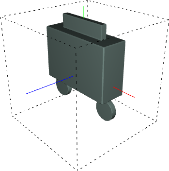
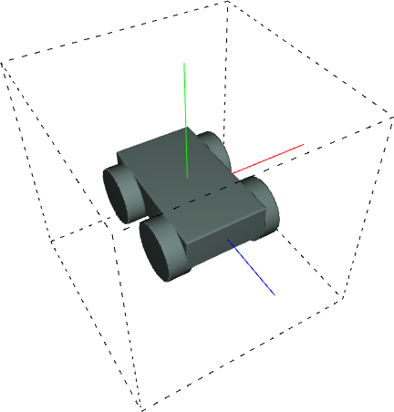
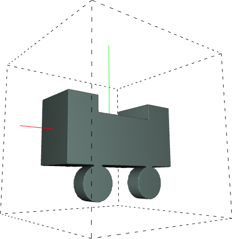
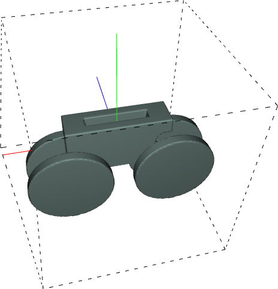
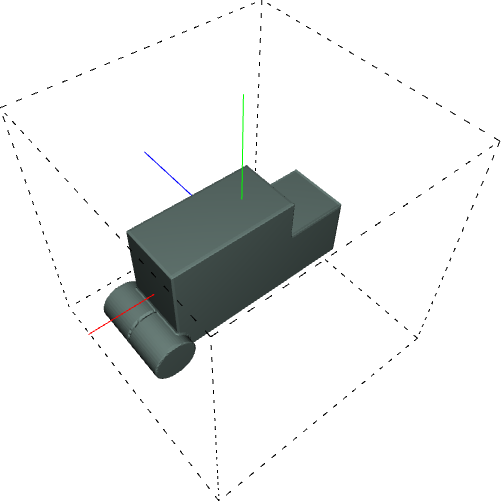

We instruct [GPT-3](https://en.wikipedia.org/wiki/GPT-3) [1] to write a computer program that generates a 3D model of an object.

The results are not good, but are interesting: with some prompt engineering, we can make them point in the right direction.

## Motivation

Due to much hyped results obtained by the MIT team in [solving college-level math problems with OpenAI Codex](https://news.mit.edu/2022/machine-learning-university-math-0803) [2],
it makes us wonder if we can apply a similar approach to 3D parametric modeling.

The main trick is to request a large language model ([OpenAI Codex](https://openai.com/blog/openai-codex/)) to write a computer program instead of a direct answer.
This offloads the computational part to a ("mechanical") programming language like Python and solves just the "intelligence" part.
To illustrate this, please see the example below taken from the paper [2].

Input (prompt) using natural language:

> Using `sympy` find the derivative of the function using the definition of the derivative. `f(x) = (x**2-1)/(2*x-3)`

Result:
```
import sympy as sp
x = sp.Symbol('x')
f = (x**2-1)/(2*x-3)
print(sp.diff(f, x))
```

Output of the program: `2*x/(2*x-3) - 2*(x**2-1)/(2*x-3)**2`

Please see the paper [2] (Figure 3) for more examples.
Some are really impressive and definitely demonstrate a kind of intelligence.

Our experiments will not be with the Codex language model, but with GPT-3 instead.
The differene between these two models is that Codex is specialized for computer code and thus might be more useful for our task.
Unfortunately, access to Codex is limited for now and thus we stick to GPT-3.

## Experiments

We will be using [LambdaCAD](https://nenadmarkus.com/lambda), a free and open-source JavaScript-based 3D CAD tool in which you describe shapes with geometric primitives and their combimantions (the union/intersection/difference operations).

Note that we show the more sensible and interesting results.
I.e., we cherry-pick some of the continuations produced by GPT-3.

### Task \#1: toy car

We use the following input to GPT-3 (prompt):

````
LambdaCAD is a tiny parametric CAD tool written in JavaScript. It enables us to make 3D models using code!

Here is a simple example of a sphere, centered at the origin, with the radius equal to 0.4:

```
return sphere(0.4);
```

We can translate the sphere with the following set of commands:

```
let x=0.1, y=0.2, z=-0.3;
return translate(sphere(0.4), x, y, z);
```

Next, let us create a union of two spheres, intersect that with a cuboid and subtract a cylinder!

```
let s1 = translate(sphere(0.2), -0.2, 0, 0);
let s2 = translate(sphere(0.2), +0.2, 0, 0);
let cb = cuboid(0.5, 0.25, 0.25)
let r=0.1, h=0.5
let cy = cylinder(r, h)
return difference(intersection(union(s1, s2), cb), cy)
```

Ok, that was cool. Let us now make a toy car.
````

We instruct the GPT-3 to produce a continuation of the above text.

An example is given below.

````
```
// Create the body of the car
let body = translate(cuboid(1.5, 1, 0.5), 0, 0.25, 0)
// Add the wheels
let r = 0.2, h = 0.1
let w1 = translate(cylinder(r, h), -0.6, -0.5, 0)
let w2 = translate(cylinder(r, h), +0.6, -0.5, 0)
// Add the windscreen
let ws = translate(cuboid(1, 0.5, 0.1), 0, 0.75, 0)
// Add the headlights
let h1 = translate(sphere(0.1), -0.5, 0.5, 0)
let h2 = translate(sphere(0.1), +0.5, 0.5, 0)
// Join everything together
return union(body, union(w1, w2), ws, union(h1, h2))
```

LambdaCAD is still in the early stages of development. While it can be used to create simple solid models, it lacks many features that are found in traditional CAD tools. However, it is still possible to create some cool 3D models with LambdaCAD!
````

It seems rather sensible: the paragraph in the end is most certainly true :)
And a human would also approach the modeling in such a way: make the parts first and then combine these in the end.

However, if the generated code is input into [LambdaCAD](https://nenadmarkus.com/lambda), we get the following shape:

<center>

</center>

Calling that a car is quite a stretch (to put it mildly).
However, in some strange way, it does resemble a kind of a vehicle.

Here is another example of a continuation (we use only the relevant part, i.e., the code):

```
let w = 0.7, h = 0.3, l = 1.2
let car_frame = difference(cuboid(w, h, l), union(cylinder(0.1, h), cylinder(0.1, h)))
let r = 0.25, s = 0.2
let wheel1 = translate(
  rotate(cylinder(r, s), 90, 0, 1, 0),
  -0.4, -0.1, 0.35)
let wheel2 = translate(
  rotate(cylinder(r, s), 90, 0, 1, 0),
  0.4, -0.1, 0.35)
let wheel3 = translate(
  rotate(cylinder(r, s), 90, 0, 1, 0),
  -0.4, -0.1, -0.35)
let wheel4 = translate(
  rotate(cylinder(r, s), 90, 0, 1, 0),
  0.4, -0.1, -0.35)
return union(car_frame, union(wheel1, union(wheel2, union(wheel3, wheel4))))
```

This is not a valid LambdaCAD program since the rotate operator has a different syntax
(`rotate(S, angle in degrees, vx, vy, vz)` should be `rotate(S, [vx, vy, vz], angle in radians)`).
The GPT-3 could not possibly have known this from its limited training prompt, so we manually modify the code:

```
let w = 0.7, h = 0.3, l = 1.2
let car_frame = difference(cuboid(w, h, l), union(cylinder(0.1, h), cylinder(0.1, h)))
let r = 0.25, s = 0.2
let wheel1 = translate(
  rotate(cylinder(r, s), [0, 1, 0], 3.14/2),
  -0.4, -0.1, 0.35)
let wheel2 = translate(
  rotate(cylinder(r, s), [0, 1, 0], 3.14/2),
  0.4, -0.1, 0.35)
let wheel3 = translate(
  rotate(cylinder(r, s), [0, 1, 0], 3.14/2),
  -0.4, -0.1, -0.35)
let wheel4 = translate(
  rotate(cylinder(r, s), [0, 1, 0], 3.14/2),
  0.4, -0.1, -0.35)
return union(car_frame, union(wheel1, union(wheel2, union(wheel3, wheel4))))
```

The code above produces the following shape:

<center>

</center>

Here are some more examples:

<table align="center">
  <tr>
    <td><pre>let body = difference(
  cuboid(0.8, 0.4, 0.3),
  translate(cuboid(0.4, 0.2, 0.3), 0, 0.2, 0)
);
let wheel1 = translate(
  difference(
    cylinder(0.1, 0.3),
    translate(
      cylinder(0.1, 0.3),
      0, 0, 0.1
    )
  ),
  -0.2, -0.3, 0
)
let wheel2 = translate(wheel1, +0.4, 0, 0);
return union(body, wheel1, wheel2);</pre></td>
    <td><pre>let body = difference(
  difference(
    cuboid(1.0, 0.5, 0.3),
    translate(cylinder(0.1, 0.5), -0.45, 0, 0),
    translate(cylinder(0.1, 0.5), +0.45, 0, 0),
  ),
  translate(cylinder(0.3, 0.1), 0, 0.25, 0),
);
let wheel = translate(
  cylinder(0.4, 0.1), 0, -0.25, 0
);
return union(
  body,
  translate(wheel, -0.5, 0, 0),
  translate(wheel, +0.5, 0, 0),
  translate(wheel, -0.5, 0, -0.3),
  translate(wheel, +0.5, 0, -0.3),
);</pre></td>
    <td><pre>let body = difference(
  cuboid(0.9, 0.50, 0.30),
  translate(
    cuboid(0.3, 0.3, 0.3), -0.3, 0.20, 0
  )
)
let wheel1 = translate(
  cylinder(0.1, 0.2), 0.5, -0.2, 0.1
)
let wheel2 = translate(
  cylinder(0.1, 0.2), 0.5, -0.2, -0.1
)
return union(union(body, wheel1), wheel2)</pre></td>
  </tr>
  <tr>
    <td><center></center></td>
    <td><center></center></td>
    <td><center></center></td>
  </tr>
</table>

## Conclusion

It would be interesting to see what can we get with finetuning.

OpenAI Codex might turn out to be a more capable tool for the problem of parametric 3D modeling.

## References

[1] The OpenAI team. Language Models are Few-Shot Learners. <https://arxiv.org/abs/2005.14165>, 2020

[2] Drori et al. A Neural Network Solves, Explains, and Generates University Math Problems by Program Synthesis and Few-Shot Learning at Human Level. <https://arxiv.org/abs/2112.15594>, 2021
