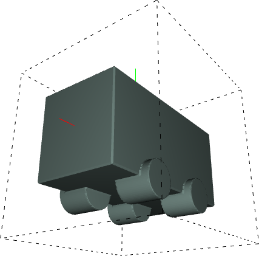
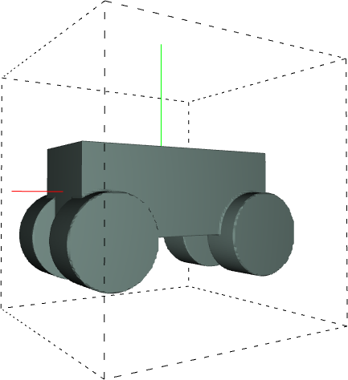
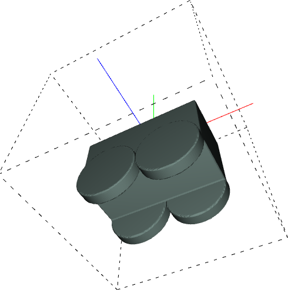

We instruct [GPT-3](https://en.wikipedia.org/wiki/GPT-3) [1] to write a computer program for [LambdaCAD](https://nenadmarkus.com/lambda/) that generates a 3D model of an object.

With prompt engineering, we can make the results point in the right direction.
Even though this is still far away from a practical solution, it is a step in the right direction.

Some examples can be seen below.

<table>
  <tr>
    <td><center></center></td>
    <td><center></center></td>
    <td><center></center></td>
    <td><center></center></td>
  </tr>
</table>

## Motivation

The MIT team's successful use of OpenAI Codex [2] to solve college-level math problems (see [here](https://news.mit.edu/2022/machine-learning-university-math-0803)) has made us wonder if a similar approach can be applied to 3D parametric modeling.

The main trick is to request a large language model ([OpenAI Codex](https://openai.com/blog/openai-codex/)) to write a computer program instead of a direct answer.
This offloads the computational part to a ("mechanical") programming language like Python and solves just the "intelligence" part.
To illustrate this, please see the example below taken from the paper [2].

Input (prompt) using natural language:

> Using `sympy` find the derivative of the function using the definition of the derivative. `f(x) = (x**2-1)/(2*x-3)`

Result:
```
import sympy as sp
x = sp.Symbol('x')
f = (x**2-1)/(2*x-3)
print(sp.diff(f, x))
```

Output of the program: `2*x/(2*x-3) - 2*(x**2-1)/(2*x-3)**2`

Please see the paper [2] (Figure 3) for more examples.
Some are really impressive and definitely demonstrate a kind of intelligence.

Our experiments will not be with the Codex language model, but with GPT-3 instead.
The differene between these two models is that Codex is specialized for computer code and thus might be more useful for our task.
Unfortunately, access to Codex is limited for now and thus we stick to GPT-3.

## Method

We use [LambdaCAD](https://nenadmarkus.com/lambda), a free and open-source JavaScript-based 3D CAD tool.
With LambdaCAD, you describe shapes with geometric primitives and their combinations (the union/intersection/difference operations).

We first give GPT-3 a short introduction to LambdaCAD, its syntax and give a couple of simple examples.
After that we specify the shape we would like to generate and let GPT-3 produce a continuation of the input text prompt.
In the end, we extract the shape-as-code found in the output.

Note that we show the more sensible and interesting results.
In other words, we cherry-pick some of the continuations produced by GPT-3 and leave the uninteresing/wrong ones out.

## Making a toy car

In the prompt, we first introduce LambdaCAD and provide examples.
This is a few-shot learning setting that prepares GPT-3 for our task.
Next, we provide a textual description of a 3D model that we would like it to generate.
See the exact input below.

````
LambdaCAD is a tiny parametric CAD tool written in JavaScript. It enables us to make 3D models using code!

Here is a simple example of a sphere, centered at the origin, with the radius equal to 0.4:

```
return sphere(0.4);
```

We can translate the sphere with the following set of commands:

```
let x=0.1, y=0.2, z=-0.3;
return translate(sphere(0.4), x, y, z);
```

Next, let us create a union of two spheres, intersect that with a cuboid and subtract a cylinder!

```
let s1 = translate(sphere(0.2), -0.2, 0, 0);
let s2 = translate(sphere(0.2), +0.2, 0, 0);
let cb = cuboid(0.5, 0.25, 0.25)
let r=0.1, h=0.5
let cy = cylinder(r, h)
return difference(intersection(union(s1, s2), cb), cy)
```

Ok, that was cool. Let us now make a toy car.
````

We instruct the GPT-3 to produce a continuation of the above text.

An example is given below.

````
```
// Create the body of the car
let body = translate(cuboid(1.5, 1, 0.5), 0, 0.25, 0)
// Add the wheels
let r = 0.2, h = 0.1
let w1 = translate(cylinder(r, h), -0.6, -0.5, 0)
let w2 = translate(cylinder(r, h), +0.6, -0.5, 0)
// Add the windscreen
let ws = translate(cuboid(1, 0.5, 0.1), 0, 0.75, 0)
// Add the headlights
let h1 = translate(sphere(0.1), -0.5, 0.5, 0)
let h2 = translate(sphere(0.1), +0.5, 0.5, 0)
// Join everything together
return union(body, union(w1, w2), ws, union(h1, h2))
```

LambdaCAD is still in the early stages of development. While it can be used to create simple solid models, it lacks many features that are found in traditional CAD tools. However, it is still possible to create some cool 3D models with LambdaCAD!
````

The continuation seems sensible: the paragraph in the end is certainly true :)
A human would approach modeling in the same way by first making the parts and then combining them.

However, if the generated code is input into [LambdaCAD](https://nenadmarkus.com/lambda), we get the following shape:

<center>

</center>

That is not a car.
However, in some strange way, it does resemble a kind of a vehicle.

Here is another example of a continuation (we use only the relevant part, i.e., the code):

```
let w = 0.7, h = 0.3, l = 1.2
let car_frame = difference(cuboid(w, h, l), union(cylinder(0.1, h), cylinder(0.1, h)))
let r = 0.25, s = 0.2
let wheel1 = translate(
  rotate(cylinder(r, s), [0, 1, 0], 3.14/2),
  -0.4, -0.1, 0.35)
let wheel2 = translate(
  rotate(cylinder(r, s), [0, 1, 0], 3.14/2),
  0.4, -0.1, 0.35)
let wheel3 = translate(
  rotate(cylinder(r, s), [0, 1, 0], 3.14/2),
  -0.4, -0.1, -0.35)
let wheel4 = translate(
  rotate(cylinder(r, s), [0, 1, 0], 3.14/2),
  0.4, -0.1, -0.35)
return union(car_frame, union(wheel1, union(wheel2, union(wheel3, wheel4))))
```

(We manually replaced `rotate(S, angle in degrees, vx, vy, vz)` with `rotate(S, [vx, vy, vz], angle in radians)`.
The GPT-3 could not have known this syntax from its limited training prompt.)

Here is the result:

<center>

</center>

Here are some more interesting examples:

<table align="center">
  <tr>
    <td><pre style="font-size:0.6em">let body = difference(
  cuboid(0.8, 0.4, 0.3),
  translate(cuboid(0.4, 0.2, 0.3), 0, 0.2, 0)
);
let wheel1 = translate(
  difference(
    cylinder(0.1, 0.3),
    translate(
      cylinder(0.1, 0.3),
      0, 0, 0.1
    )
  ),
  -0.2, -0.3, 0
)
let wheel2 = translate(wheel1, +0.4, 0, 0);
return union(body, wheel1, wheel2);</pre></td>
    <td><pre style="font-size:0.6em">let body = difference(
  difference(
    cuboid(1.0, 0.5, 0.3),
    translate(cylinder(0.1, 0.5), -0.45, 0, 0),
    translate(cylinder(0.1, 0.5), +0.45, 0, 0),
  ),
  translate(cylinder(0.3, 0.1), 0, 0.25, 0),
);
let wheel = translate(
  cylinder(0.4, 0.1), 0, -0.25, 0
);
return union(
  body,
  translate(wheel, -0.5, 0, 0),
  translate(wheel, +0.5, 0, 0),
  translate(wheel, -0.5, 0, -0.3),
  translate(wheel, +0.5, 0, -0.3),
);</pre></td>
    <td><pre style="font-size:0.6em">let body = difference(
  cuboid(0.9, 0.50, 0.30),
  translate(
    cuboid(0.3, 0.3, 0.3), -0.3, 0.20, 0
  )
)
let wheel1 = translate(
  cylinder(0.1, 0.2), 0.5, -0.2, 0.1
)
let wheel2 = translate(
  cylinder(0.1, 0.2), 0.5, -0.2, -0.1
)
return union(union(body, wheel1), wheel2)</pre></td>
  </tr>
  <tr>
    <td><center></center></td>
    <td><center></center></td>
    <td><center></center></td>
  </tr>
</table>

## Adding more instructions to the prompt

The prompt as before, but we modify the end part to

> "Ok, that was cool. Let us now make a toy car. First, we use a cuboid to make a chassis. Next, we make each of the four wheels of our car by translating a cylinder and attaching it to the chassis."

The results are now repeatable.
In all the tried prompt runs, we got reasonable output.
See below for some examples.

<table align="center">
  <tr>
    <td><pre style="font-size:0.6em">let cb = cuboid(1.0,0.5,0.5);
let r = 0.1, h = 0.2;
let w1 = translate(cylinder(r, h), -0.2, -0.25, 0.2);
let w2 = translate(cylinder(r, h), 0.2, -0.25, 0.2);
let w3 = translate(cylinder(r, h), -0.2, -0.25, -0.2);
let w4 = translate(cylinder(r, h), 0.2, -0.25, -0.2);
return union(cb, w1, w2, w3, w4);</pre></td>
    <td><pre style="font-size:0.6em">let cb = cuboid(0.5, 0.2, 0.2);
let r=0.1, h=0.1;
let w1 = translate(cylinder(r, h), +0.2, -0.1, +0.1);
let w2 = translate(cylinder(r, h), +0.2, -0.1, -0.1);
let w3 = translate(cylinder(r, h), -0.2, -0.1, +0.1);
let w4 = translate(cylinder(r, h), -0.2, -0.1, -0.1);
return union(cb, w1, w2, w3, w4);</pre></td>
    <td><pre style="font-size:0.6em">let ch = translate(cuboid(1, 0.5, 0.5), 0.0, -0.25, 0.0);
let r=0.25, h=0.1;
let wh1 = translate(cylinder(r, h), -0.25, -0.5, -0.25);
let wh2 = translate(cylinder(r, h), +0.25, -0.5, -0.25);
let wh3 = translate(cylinder(r, h), -0.25, -0.5, +0.25);
let wh4 = translate(cylinder(r, h), +0.25, -0.5, +0.25);
return union(ch, wh1, wh2, wh3, wh4);</pre></td>
  </tr>
  <tr>
    <td><center></center></td>
    <td><center></center></td>
    <td><center></center></td>
  </tr>
</table>

## Conclusion

The results might not look great, but do indicate potential.

There seem to be at least four possible ways for improvement.

1. Use a larger language model (these are coming for sure!)
2. Use a model specialized for code (like OpenAI Codex)
3. Find better input prompts
4. Finetune the model for the task

## References

[1] The OpenAI team. Language Models are Few-Shot Learners. <https://arxiv.org/abs/2005.14165>, 2020

[2] Drori et al. A Neural Network Solves, Explains, and Generates University Math Problems by Program Synthesis and Few-Shot Learning at Human Level. <https://arxiv.org/abs/2112.15594>, 2021
