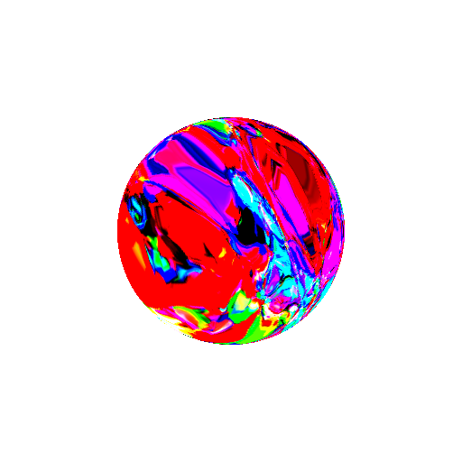
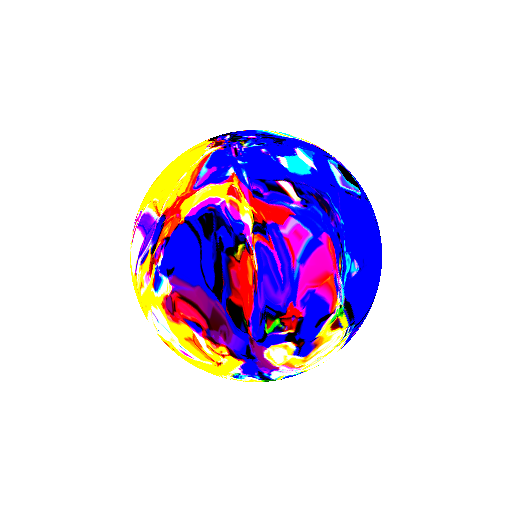
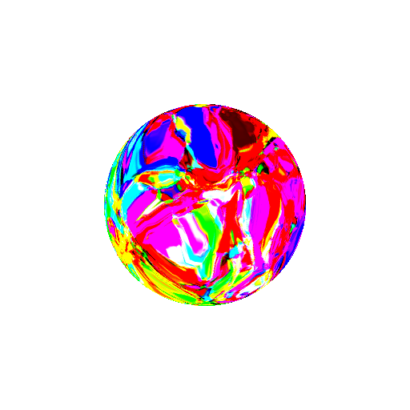
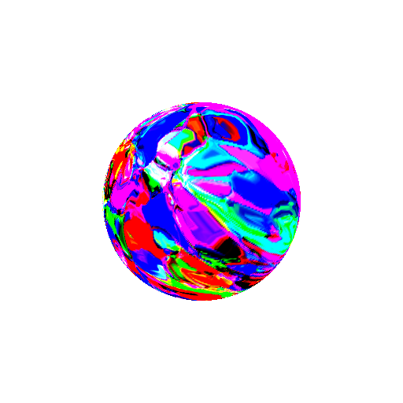

This post is a continuation of our [previous work](../visualizing-audio-with-cppns) on CPPNs.
Please read there about the basics of CPPNs and the notation we use here.

The ideas, code and experiments described in this post enable us to render abstract shapes such as the following one.

<video style="width: 75%; height: 75%; max-width: 384px; max-height: 384px;" autoplay loop="" muted="" playsinline="">
<source src="https://drone.nenadmarkus.com/data/blog-stuff/chromatic-orb.mp4" type="video/mp4">
</video>

The basic idea is to assign an RGB color value to each point on the surface of a 3D mesh with a CPPN.
Recall that in our [last post](../cppns-on-3d-surfaces) we denoted the input as $`\mathbf{h}_0`$
(this vector, along with the parameters/structure of the CPPN, determines the color for a 3D point).
Thus, in the case of 3D space:

$$
	\mathbf{h}_0=
	\begin{pmatrix}
                x\\
                y\\
                z
        \end{pmatrix}
$$

It's that simple:
for each point on the surface, run its coordinates through a CPPN and obtain the RGB color intensities.
Next, we use a 3D renderer to render this colored model onto the screen.
The above video shows the simplest shape colored in this way: a sphere.
The result nevertheless looks interesting.
Of course, it is possible to apply the described colorization process to other shapes as well.

As usual, we provide more technical details and code.

## Rendering chromatic orbs with OpenGL

We use [OpenGL](https://en.wikipedia.org/wiki/OpenGL) in our experiments even though it is starting to become obsolete in favor of modern 3D APIs, such as [Vulkan](https://www.khronos.org/vulkan/) and [Metal](https://developer.apple.com/metal/).
The main reason are the stable Python bindings (which makes it convenient for fast prototyping) and an [excellent book](http://www.labri.fr/perso/nrougier/python-opengl/) by [Nicolas P. Rougier](https://www.labri.fr/perso/nrougier/).
Specifically, we modify the section "5.4.1 Colored cube" for our purposes.

Instead of a cube, we render a sphere.
Since OpnGL works with polygons, we first have to compute the vertices/triangles that approximate a sphere.
A simple way to do this is by recalling the link between the [spherical coordinate system](https://en.wikipedia.org/wiki/Spherical_coordinate_system) and the [Cartesian one](https://en.wikipedia.org/wiki/Cartesian_coordinate_system).
A point $`(x, y, z)`$ also has the following representation:

$$
	\begin{matrix}
	x=&r\cos\theta\sin\phi\\
	y=&r\sin\theta\sin\phi\\
	z=&r\cos\phi
	\end{matrix}
$$

for some $`r\in[0, \infty)`$, $`\theta\in[0, 2\pi)`$ and $`\phi\in[0, \pi]`$
(the radial, azimuthal and polar component, respectively).
Obtaining a set of vertices on a sphere now consists of setting a radius $`r`$ to some constant and uniformly sampling $`\theta`$ and $`\phi`$.
The triangles are generated by connecting neigbouring triplets of vertices.
A more thorough discussion of the whole process can be found [here](https://gamedev.stackexchange.com/questions/16585/how-do-you-programmatically-generate-a-sphere).

We assign a color only to each vertex on the model due to computational and memory reasons.
Colors of other points are interpolated by OpenGL.
This significantly simplifies the whole pipeline.
However, note that potentially large number of vertices (and, consequentially, triangles) are required to obtain a feel of a smooth surface.

The program is available at the following link: [sferogen.py](sferogen.py).
To run it, you need to install [`glumpy`](https://glumpy.github.io) (a simplified OpenGL interface for Python).
Also, see [this post](../visualizing-audio-with-cppns) that briefly explains how a sequence of frames is stitched into a video via FFmpeg.
Some example renderings of the program are shown in the following images.

Note that the program is quite inefficient.
Its worst part is the process of generating vertices on the sphere.
If the reader delves in some non-superficial analysis of the code,
he/she might notice that the Cartesian coordiantes of each vertex are computed multiple times
(4 to be exact).
This issue could be completely solved by restructuring the code in a smarter way.
Also, as a general rule in Python, `for` loops should be avoided for any kind of serious computation:
one should use `numpy` instead.
Both of the mentioned flaws are simple to rectify.
However, we do not bother ourselves with this since real-time processing is not required in our case:
we generate our images/videos offline.

## Future work

It would be interesting to modify the whole procedure to include a time-varying colorization of the shape.
This could be achieved in a similar manner as in our [last post](../visualizing-audio-with-cppns):
we can simply add a time-varying input to the CPPN.
However, the required modifications to the program linked above are significant and we leave it for a potential future post.
