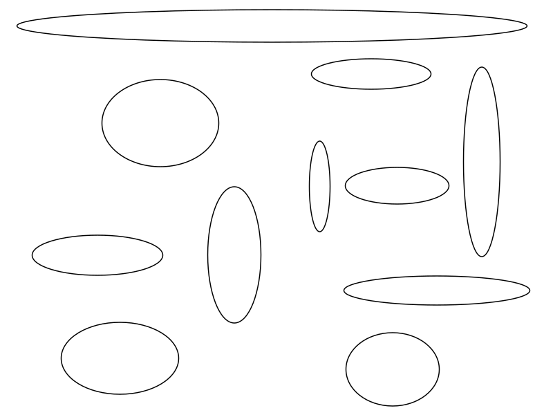

This post analyzes the problem of fitting an axis-aligned ellipse to a set of points lying in a 2D plane.
To be more specific, given an image such as the one below, our goal is to devise an algorithm that extracts all the ellipses from it.

This problem  can be formulated as fitting a parametric equation to a set of points.
There are two useful ways to parameterize an ellipse in the $$xy$$ plane.
We use both in this post.

In [analytic geometry](https://en.wikipedia.org/wiki/Analytic_geometry), a general implicit equation of a [conic section](https://en.wikipedia.org/wiki/Conic_section), of which an ellipse is a special calse, can be written down as the following quadratic form:

$$
	Ax^2 + 2Bxy + Cy^2 + 2Dx + 2Ey + F = 0
$$

Of course, not all possible values of $$A$$, $$B$$, $$C$$, $$D$$, $$E$$ and $$F$$ give an ellipse.
You can read about the specific constraints [here](http://mathworld.wolfram.com/Ellipse.html).
We will not explicitly enforce these constraints in our ellipse-fitting algorithms because they will be based on [RANSAC](https://en.wikipedia.org/wiki/Random_sample_consensus).

In our case, $$B=0$$ since we are interested in axis-aligned ellipses.
Also, we can set $$F=1$$ to simplify the computation and handle the case $$F=0$$ separately.

An equivalent form, parameterized by the ellipse center, $$(\bar{x}, \bar{y})$$, and the two axes, $$a$$ and $$b$$, is given by the following equation:

$$
	\frac{(x - \bar{x})^2}{a^2} + \frac{(y - \bar{y})^2}{b^2} = 1
$$

We base our algorithms on the first form and then switch to the second form when needed via the following equations:

$$
	\bar{x} = -\frac{D}{A}
	\;\;\;\;\;\;\;\;\;\;
	\bar{y} = -\frac{E}{C}
$$

$$
	a=\sqrt{
		-\frac{F}{A} + \frac{D^2}{A^2} + \frac{E^2}{A\cdot C}
	}
$$

$$
	b=\sqrt{
		-\frac{F}{C} + \frac{D^2}{A\cdot C} + \frac{E^2}{C^2}
	}
$$

## A 4-point algorithm

We assume that we have four points lying on the ellipse: $$(x_1, y_1), (x_2, y_2), (x_3, y_3), (x_4, y_4)$$.
Our task is to find the parameters of the ellipse based on these four points.

First, we handle the case $$F\neq 0$$.
We assume that $$B=0$$ (i.e., that the ellipse is axis-aligned), fix $$F$$ to $$1$$ and insert the above four points into the ellipse equation to get the following system:

$$
	Ax_1^2 + Cy_1^2 + 2Dx_1 + 2Ey_1 = -1
$$

$$
	Ax_2^2 + Cy_2^2 + 2Dx_2 + 2Ey_2 = -1
$$

$$
	Ax_3^2 + Cy_3^2 + 2Dx_3 + 2Ey_3 = -1
$$

$$
	Ax_4^2 + Cy_4^2 + 2Dx_4 + 2Ey_4 = -1
$$

The above smalle linear system can be solved by applying [Cramer's rule](https://en.wikipedia.org/wiki/Cramer%27s_rule).
If the solution does not exist (the determinant of the system's matrix is $$0$$), we handle the case $$F=0$$.

To handle multiple ellipses, we can use sequential RANSAC.
The idea is to iterate the following two steps until no new solutions can be obtained:

1. run ordinary RANSAC until a solution is found (iteratively sample four points, fit an ellipse and count inliers; output a solution if number of inliers is above a threshold)
2. remove *all* the points from the 2D plane that belong to the solution output in the previous step

Although simple, the algorithm has a number of parameters that need to be tuned in order to obtain good results.

## Fitting an ellipse from two points and gradient information

The problem with the algorithm from previous section that it might take a long time to converge to a solution if a large number of ellipses are present in the plane.
This is due to the sampling startegy we must use: four points are randomly chosen in each iteration of RANSAC.
To obtain a valid solution, all these points have to be sampled from the same ellipse.
The probability of this happening can be low if the number of ellipses is high.

The probability of selecting two points from the same ellipse is much higher, but we need gradient information in order to find all its parameters.
The gradient information can be obtained by using surrounding points within some predefined distance to fit a tangent to the ellipse.
The fitting process boils down to finding the parameters of a line in [Hesse normal form](https://en.wikipedia.org/wiki/Hesse_normal_form) with the [least squares method](https://en.wikipedia.org/wiki/Least_squares).

Each ellipse can be seen as an implicit funciton of the form $$f(x, y)=0$$.
The derivative $$\frac{\mathrm{d}y}{\mathrm{d}x}$$ can be computed analytically as (see [here](https://en.wikipedia.org/wiki/Implicit_function#Implicit_differentiation)):

$$
	\frac{\mathrm{d}y}{\mathrm{d}x}=
	-\frac{\frac{\partial f}{\partial x}}{\frac{\partial f}{\partial y}}=
	-\frac{Ax + D}{Cy + E}
$$

Note that the above equation is a linear one when $$\frac{\mathrm{d}y}{\mathrm{d}x}$$ is known.

If we fix $$F=1$$, this leads us to the following four equations derived from two points and their gradients:

$$
	Ax_1^2 + Cy_1^2 + 2Dx_1 + 2Ey_1 = -1
$$

$$
	Ax_2^2 + Cy_2^2 + 2Dx_2 + 2Ey_2 = -1
$$

$$
	Ax_1 + D + \rho_1(Cy_1 + D) = 0
$$

$$
	Ax_2 + D + \rho_2(Cy_2 + D) = 0
$$

where $$\rho_1$$ and $$\rho_2$$ are the derivatives $$\frac{\mathrm{d}y}{\mathrm{d}x}$$ obtained from the tangent lines in the first and second points, respectively.

The above linear system can also be solved by applying Cramer's rule.
Also, as explained in the previous section, we can use sequential RANSAC to extract multiple ellipses if present.

## Numerical stability

To obtain greater numerical stability, it is often beneficial to divide the points by the maximum absolute value of the coordinates and re-scale the linear-system solution afterwards by this same factor.
The approach significantly improves accuracy and fitting times in some cases.

## Resources

* <https://en.wikipedia.org/wiki/Ellipse>
* <https://en.wikipedia.org/wiki/Conic_section>
* <http://mathworld.wolfram.com/Ellipse.html>
