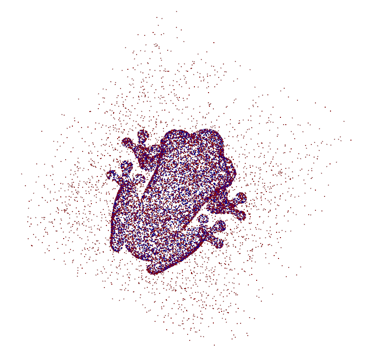

There has been considerable interest in learning-based methods for signed distance field modeling.
And this is lately especially true in the area of deep learning:
see section "Implicit representation" at [https://github.com/subeeshvasu/Awsome_Deep_Geometry_Learning](https://github.com/subeeshvasu/Awsome_Deep_Geometry_Learning).

Thus, it is warranted to investigate whether [gridhopping](../fast-algo-sdb-to-mesh) and [lambdaCAD](https://lambdacad.gitlab.io) are useful in this area.
E.g., for extracting polygonal models from such representations for debugging or rendering purposes.

Here is a selection of interesting papers on geometric deep learning:

1. Zhiqin Chen and Hao Zhang. Learning Implicit Fields for Generative Shape Modeling. CVPR, 2019 ([arXiv](https://arxiv.org/abs/1812.02822))
2. Park et al. DeepSDF: Learning Continuous Signed Distance Functionsfor Shape Representation. CVPR, 2019 ([arXiv](https://arxiv.org/abs/1901.05103))
3. Li et al. Supervised Fitting of Geometric Primitives to 3D Point Clouds. CVPR, 2019 ([arXiv](https://arxiv.org/abs/1811.08988))
4. Davies et al. Overfit Neural Networks as a Compact Shape Representation. [https://arxiv.org/abs/2009.09808](https://arxiv.org/abs/2009.09808), 2020

These papers illustrate some core ideas and applications within the area.
The first two study the learning of **generative** models for 3D shapes.
I.e., for applications that need to generate novel 3D shapes belonging to a certain class, such as aeroplanes of cars.
This could be useful in computer games and some types of viritual reality software, for example.
In [1], the authors propose to model a shape as an occupancy map ($$+1$$ outside shape, $$-1$$ inside) with a neural network classifier.
Since this representaion is smooth, it is capable of defining shapes as implicit sufraces.
However, the approach would probably not work well with sphere tracing because of issues ontlined in a [previous post](../lipschitz-continuity-and-sphere-tracing) about [Lipschitz continuity](https://en.wikipedia.org/wiki/Lipschitz_continuity).
On the other hand, the authors of [2] propose to model a 3D shape $$S$$ with a neural network that is learned to estimate the signed distance field:

$$
	\text{NN}(x, y, z)\approx
	d_S(x, y, z)
$$

Of course, there are some caveats that simplify the process and enable learning of a generative model.
Please see the paper for these details.
Even though the network is explicitly learned to approximate the distance to the shape, there is no guarantee that sphere tracing will work as intended (especially when far away from the shape),
but we expect less problems than with occupancy maps.
The paper by Li et al. [3] contains a similar approach to that of [2] except that it is not concerned with generative modeling, but with shape compression.
I.e., each shape is assigned a separate tiny network that approximates its signed distance field.
The hope is that this tiny network requires less memory to store than an explicit list of polygons, effectively enabling a compressed representation.
Thus, this approach has the same potential to be compatible with `gridhopping` as [2].
The fourth paper mentioned earlier (Davies et al. [4]) uses a neural network that outputs a list of primitives and their parameters to approximate an input point cloud.
Since the basic primitives used (spheres, cones, etc.) have explicit and efficiently computable signed distance fields, this approach is compatible with `gridhopping`.

Given the interesting resluts presented in the mentioned papers,
we experiment with two learning algorithms for converting a 3D polygonal mesh into a signed distance field.
The first one is based on random Fourier features and the second one on a simple feedforward neural network.
However, let us first describe the shapes we use and how we prepare the training data.

## Training data

We use the following 3D shapes:

Our goal is to transform these shapes into signed distance fields.

Given such a shape $$S$$, we generate a trainig set of the form

$$
	\left\{(\mathbf{x}_i, d_i)\right\}_{i=1}^N
$$

where $$\mathbf{x}\in\mathbb{R}^3$$ is a point in 3D space and $$d_i$$ is the Euclidean distance from $$\mathbf{x}$$ to the surface of $$S$$.
This is conceptually very simple, but there are some subtleties.

In our experiments, $$S$$ is represented as a triangle mesh.
We generate the trainig data with the help of the excellent [mesh-to-sdf library](https://github.com/marian42/mesh_to_sdf):

	import mesh_to_sdf
	import trimesh
	mesh = trimesh.load("/path/to/mesh.stl")
	xyz, dists = mesh_to_sdf.sample_sdf_near_surface(mesh, number_of_points=250000)
	xyz, dists = xyz/2.0, dists/2.0 # normalize to unit cube

After the above code is executed, the `xyz` variable is a 2D `numpy` array containing $$250\;000$$ $$(x, y, z)$$ points sampled inside a unit cube centered at the origin and `dists` contains the distances of these points to the shape.
Some of the points are sampled uniformly inside the unit cube, but the majority come from the surface of the mesh.
Of course, prior to sampling, the mesh is re-scaled to fit the unit cube.
An example point cloud obtained in this way is illustrated in the following image:

The points outside the shape are colorized red and the ones inside are blue.
These inside points are assigned negative distances.
This is the usual procedure when working with [signed distance fields](../fast-algo-sdb-to-mesh).

Given such a training set, we can now describe two basic learning approaches that are used in our `gridhopping` experiments later.

## Approximating a signed distance field with weighted Fourier features

We have used Fourier features in a [previous post](../fourier-features-graphics), but we go over the basics here once again for completeness.

Let $$\mathbf{v}=(x, y, z)^T$$ be a vector representing a point location in 3D space.
Fourier features computed from $$\mathbf{v}$$ are defined as

$$
	\text{FF}(\mathbf{v})=
	\left(
		\cos(2\pi\mathbf{f}_1^T\mathbf{v}), \sin(2\pi\mathbf{f}_1^T\mathbf{v}),
		\cos(2\pi\mathbf{f}_2^T\mathbf{v}), \sin(2\pi\mathbf{f}_2^T\mathbf{v}),
		\ldots,
		\cos(2\pi\mathbf{f}_N^T\mathbf{v}), \sin(2\pi\mathbf{f}_N^T\mathbf{v})
	\right)^T
$$

where $$\mathbf{f}_i$$ are the frequency vectors.
In our experiments, we sample these from a standard normal distribusion with zero mean and a standard deviation $$\sigma$$.
Of course, $$\mathbf{f}_i$$s are generated at the beginning and stay fixed during the whole experiment.
Setting $$\sigma=3$$, $$N=1024$$ worked well for in our experiments and thus we keep these values.

The idea is to approximate the signed distance $$d_S$$ to shape $$S$$ as a weighted average of Fourier features:

$$
	d_S(\mathbf{v})\approx
	\mathbf{w}^T\cdot \text{FF}(\mathbf{v})
$$

The weights $$\mathbf{w}\in\mathbb{2N}$$ have to be computed (learned) with some kind of an optimization procedure.
A simple and effective procedure is to first compute Fourier features for all poitns $$\mathbf{v}_j$$ in the dataset:

$$
	\mathbf{V}_j=
	\text{FF}(\mathbf{v}_j)
$$

and then find $$\mathbf{w}$$ that minimizes

$$
	J(\mathbf{w})=
	\sum_{j}\left( \mathbf{w}^T\mathbf{V}_j - d_j \right)^2
$$

where $$d_j=d_S(\mathbf{v}_j)$$ is the distance from the $$j$$th point to the shape $$S$$.

This is an ordinary least squares problem and it has an efficient closed-form solution: [https://en.wikipedia.org/wiki/Ordinary_least_squares](https://en.wikipedia.org/wiki/Ordinary_least_squares).
These properties make the proposed method quite elegant.
However, we have encountered several empirical shortcomings when dealing with more complex shapes.
Detailed analysis of these issues is out of scope for this post and we now focus on `gridhopping`.

You may recall that if [certain criteria](../lipschitz-continuity-and-sphere-tracing) are not met,
`gridhopping` might "miss" parts of the surface of the shape and render an incomplete mesh.
To circumvent these problems, we shrink the signed distance approximation by factor $$\lambda$$:

$$
	\text{SDF}(x, y, z)=
	\frac{\mathbf{w}^T\cdot \text{FF}(x, y, z)}{\lambda}
$$
