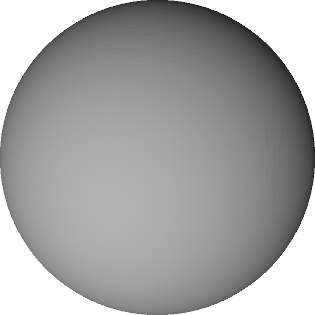
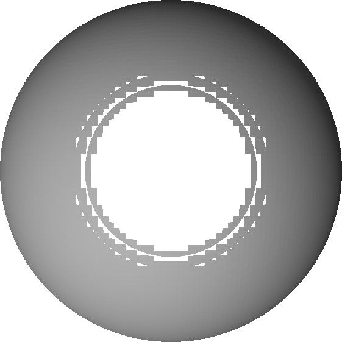

A function $$f:D\rightarrow \mathbb{R}$$ (with $$D$$ a subset of $$\mathbb{R}^n$$) is called **Lipschitz continuous** if there exists a constant $$\lambda \geq 0$$ such that for all $$\mathbf{x}, \mathbf{y}\in D$$ the following inequality holds:

$$
	\vert f(\mathbf{x}) - f(\mathbf{y})\vert \leq \lambda \vert\vert\mathbf{x} - \mathbf{y}\vert\vert
$$

Let us denote smallest such $$\lambda$$ as $$\lambda^*$$ and call it the **Lipschitz constant**.

## Importance for sphere tracing

As explained by J. C. Hart, sphere tracing requires Lipschitz continuity to work correctly.
Morever, the associated $$\lambda^*$$ has to be smaller than or equal to $$1$$.
If this is not the case, we cannot take $$f(\mathbf{x})$$ as the step size along the ray without the risk to "overshoot" the surface.

To see this, recall that $$f_S$$ is a signed distance bound of $$S$$ if and only if for all $$\mathbf{x}\in\mathbb{R}^3$$ we have

$$
	\vert f_S(\mathbf{x})\vert\leq
	\min_{\mathbf{y}\in f_S^{-1}(0)}\vert\vert\mathbf{x} - \mathbf{y}\vert\vert_2
$$

where $$f_S^{-1}(0)=\{\mathbf{z}: f_S(\mathbf{z})=0\}$$.
If we assume that $$f_S$$ is Lipschitz continuous with Lipschitz constant $$\lambda^*$$, then for any point $$\mathbf{x}$$ and $$\mathbf{z}$$ such that

$$
	\vert\vert\mathbf{x} - \mathbf{z}\vert\vert\_2=
	\min_{\mathbf{y}\in f_S^{-1}(0)}\vert\vert\mathbf{x} - \mathbf{y}\vert\vert_2
$$

we have

$$
	\vertf(\mathbf{x})\vert\leq
	\lambda^*\vert\vert\mathbf{x} - \mathbf{z}\vert\vert_2=
	\lambda^*\min_{\mathbf{y}\in f_S^{-1}(0)}\vert\vert\mathbf{x} - \mathbf{y}\vert\vert_2
$$

Thus, to mitigate overestimating the distance, in which case sphere tracing can "overshoot" the surface and penetrate the shape, we must have $$\lambda^*\leq 1$$.
This is a **sufficient condition** to avoid the mentioned problem.

If $$\lambda^*$$ is greater than $$1$$, we can replace $$f_S$$ by $$f_S/\lambda^*$$.
The resulting function has an optimal Lipschitz constant, $$1$$.

In the context of the [lambdaCAD tool](https://lambdacad.gitlab.io), we can get holes in the generated mesh if $$\lambda^* > 1$$.
This is demonstrated in the next section.

## An illustrative example

Let us consider a shape defined by a implicit function $$F(x, y, z) = x^2 + y^2 + z^2 - 4 = 0$$.
It is not hard to see that this is a sphere of radius $$2$$ centered at the origin.
The function $$F$$ is not Lipschitz continuous on $$\mathbb{R}^3$$ since it's derivative is not bounded (more on that later).
However, if we constrain ourselves to a region $$[-2, +2]^3$$, then we can construct a signed distance bound $$f(x, y, z)=F(x, y, z)/\lambda$$ for $$\lambda=4$$.

The following snippet is an implementation of $$f$$ for [https://lambdacad.gitlab.io](https://lambdacad.gitlab.io):

```
return function (x, y, z) {
	const r = 2;
	const lam = 4;
	return (x*x + y*y + z*z - r*r)/lam;
};
```

Setting `size=4` and `resolution=100` produces the following mesh:

<center>

</center>

The above representation looks as expected.
However, if we change $$\lambda$$ from $$4$$ to $$3$$ (set `lam=3` in the code snippet), we get holes in the model (some triangles are missing):

<center>

</center>

This is due to sphere tracing occasionally "missing" the surface of the shape and immediately "jumping" in its interior.
A consequence of overestimating some distances because of wrong $$\lambda$$.

## Useful properties related to Lipschitz continuity

We assume that $$f$$ and $$g$$ are Lipschitz continuous with associated constants $$\lambda_f$$ and $$\lambda_g$$, respectively.

1. The sum $$f+g$$ is Lipschitz continuous:

$$
	\vert f(x)+g(x) - (f(y)+g(y))\vert \leq
	\vert f(x) - f(y)\vert + \vert g(x) - g(y)\vert \leq
	\lambda_f\vert x - y\vert + \lambda_g\vert x - y\vert=
	(\lambda_f + \lambda_g)\vert x - y\vert
$$

2. If $$\vert f\vert$$ and $$\vert g\vert$$ are bounded by some constant $$M$$, then the product $$fg$$ is Lipschitz continuous:

$$
	\vert f(x)g(x) - f(y)g(y)\vert\leq
	\vert f(x)g(x) - f(x)g(y)\vert + \vert f(x)g(y) - f(y)g(y)\vert\leq
	M\cdot( \vert g(x) - g(y)\vert + \vert f(x) - f(y)\vert )
$$

3. A continuous and differentiable function $$f$$ is Lipschitz if and only if its derivative $$f'$$ is bounded.
To prove the first implication, we assume that $$f$$ is Lipschitz continuos and work with the definition of the derivative:

$$
	\vert f'(x)\vert=
	\lim_{h\rightarrow0}\left\vert
		\frac{f(x+h) - f(x)}{h}
	\right\vert\leq
	\lim_{h\rightarrow0}\lambda_f\left\vert
		\frac{x+h - x}{h}
	\right\vert=
	\lambda_f
$$

The other implication follows from the [mean value theorem](https://en.wikipedia.org/wiki/Mean_value_theorem).
There exists $$c$$ between $$x$$ and $$y$$ such that

$$
	\vert f(x) - f(y)\vert\leq
	\vert f'(c)\vert\cdot\vert x - y\vert
$$

If we assume that $$\vert f'(c)\vert\leq M$$, then it follows that $$f$$ is Lipschitz continuous.

4. The composition $$f\circ g$$ is Lipschitz continuous:

$$
	\vert f(g(x)) - f(g(y))\vert\leq
	\lambda_f\vert g(x) - g(y)\vert\leq
	\lambda_f\lambda_g\vert x - y\vert
$$

## Resources

* J. C. Hart. Sphere tracing: A geometric method for the antialiased ray tracing of implicit surfaces. The Visual Computer, 1994.
* [https://en.wikipedia.org/wiki/Lipschitz_continuity](https://en.wikipedia.org/wiki/Lipschitz_continuity)
* [https://math.stackexchange.com/questions/2823582/sum-of-lipschitz-functions](https://math.stackexchange.com/questions/2823582/sum-of-lipschitz-functions)
* [https://math.stackexchange.com/questions/1028974/sum-and-product-of-lipschitz-functions](https://math.stackexchange.com/questions/1028974/sum-and-product-of-lipschitz-functions)
* [https://math.stackexchange.com/questions/1165431/is-a-function-lipschitz-if-and-only-if-its-derivative-is-bounded](https://math.stackexchange.com/questions/1165431/is-a-function-lipschitz-if-and-only-if-its-derivative-is-bounded)
