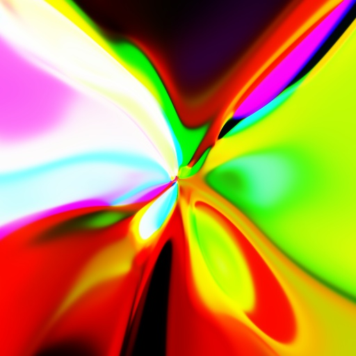

In previous posts we have seen that "random" neural networks produce interesting visual patterns when fed 2D or 3D geometry as input:

* [2D-based CPPNs](../visualizing-audio-with-cppns)
* [3D-based CPPNs](../cppns-on-3d-surfaces)

Such networks are called [CPPNs](https://en.wikipedia.org/wiki/Compositional_pattern-producing_network) in the scientific literature.
Their main applications are generative art and evolution of robotic morphologies.

However, it is clear that, in the general sense, neural networks are nothing more than function approximators.
I.e., there are no "special powers" that this class of algorithms/data structures possesses.
<!--We firmly believe that this should be clearly pointed out by the scientific community, especially due to all the noise that comes from the non-technical community (journalists, popular entrepreneurs, philosophers, etc.).-->
This post shows that **decision trees** can be used to produce qualitatively similar generative art to CPPNs.
We achieve this by randomizing the values (predictions) in leaf nodes for each tree.
These values can be seen, at least in some approximate sense, as analogous to the weights within a neural network.

We first give a high-level introduction to decision trees and forests.
With relevant terminology and tools in place, we show three experiments which demonstrate how to use decision trees to generate interesting visual patterns.

## Introduction to decision trees and forests

As you may recall from a basic machine-learning course, [decision trees](https://en.wikipedia.org/wiki/Decision_tree_learning) are popular tools (data structures, actually: <https://en.wikipedia.org/wiki/Tree_(graph_theory)>) for approximating functions from input-output pairs.
They contain two types of nodes: inner nodes and leaves.
Each inner node contains a test that routes the input data point to one of the subtrees attached to that node.
The routing is done based on some propery of the input data point.
A popular test for vector-like inputs is to compare a coordinate of the input point to a predefined threshold.
The exact value of the threshold and the coordinate to which it is applied are the parameters specific to each of the inner nodes.
These parameters can be set at random or learned from training data by some optimization technique.
This has the effect that the input space is partitioned into cells.
The granularity of this partition is determined by the depth of the tree and the number of subtrees attached to each of the inner nodes.
The number of subtrees per inner node is often set to two, i.e., binary trees are very common in practice.
This is assumed in our post as well.
Nodes without any subtrees attached to them are called leaves or terminal nodes.
These nodes contain a prediction (for example, a vector of real numbers) for the cell that they represent.

A decision tree is usually automatically learned from a dataset of input-output pairs.
However, we should not expect a single tree to achieve a desired level of accuracy due to problems with [overfitting](https://en.wikipedia.org/wiki/Overfitting).
Thus, multiple trees are learned and their predictions/outputs are summed together or averaged.
Two leading approaches to achieve this are [random forests](https://en.wikipedia.org/wiki/Random_forest) and [gradient boosting](https://en.wikipedia.org/wiki/Gradient_boosting).

For the purposes of this post, we use the [`ud3` library](https://github.com/nenadmarkus/algogear/tree/master/ud3).
This library implements a flexible yet minimalistic framework (a few hundred lines of C code) for learning decision trees which can easily be used from Python.
This will enable us to approximate functions of the form $$\mathbb{R}^{m}\rightarrow\mathbb{R}^{n}$$.

In the next three sections we show how can decision trees be used to produce interesting visual patterns.

## Approximating an image with decision trees

An image can be seen as a function that maps spatial coordinates $$(x, y)$$ into RGB color.
Here we attempt to approximate this function with an ensemble of decision trees.
Before we continue, it is interesting to note that the whole procedure can be treated as a form of image compression:
the image is "stored" in the parameters of the trees.
Of course, this scheme can be outperformed significantly on natural images by other approaches
(see <https://en.wikipedia.org/wiki/Image_compression> for more details).

The procedure that we use is extremely simple.
Each pixel in the input image is treated as a sample for the learning process.
The position of the pixel (i.e., its $$(x, y)$$ coordinates) is the input data based on which the RGB color of the pixel should be predicted.
We next use the `ud3` library to learn an ensemble of trees via gradient boosting for solving this prediction task.

Some random image (left, take from the [previous post](../visualizing-audio-with-cppns) on CPPNs) approximated with an ensemble of trees (right) is shown here:

The source code for this experiment is available in the official repository for the `ud3` library: <https://github.com/nenadmarkus/algogear/tree/master/ud3>.

Similar experiments applying machine learning to image approximation have also been described elsewhere.
Two popular posts on this topic are:

* <https://cs.stanford.edu/people/karpathy/convnetjs/demo/image_regression.html>
* <https://arogozhnikov.github.io/2016/02/09/DrawingPictureWithML.html>

Note that decision trees are discontinuous by design (unlike neural networks) and thus cannot accurately represent smooth transitions.
This is the reason why image approximations look so blocky and pixelated.
While smoothness is a property of most natural signals, decision trees have great applications in crunching human-generated structures like, e.g., tabular data.
This raises a question whether we can produce visually appealing imagery by randomizing the parameters of the tree ensemble in the analogous way as we can with CPPNs.
Due to the inherent discountinuity of the trees, this might seem unlikely.
However, in the next section we show that this is indeed possible.

## Generating abstract graphics

In the previous section we have seen that decision trees are capable of producing abstarct patterns when learned in a fully supervised way.
However, the question remains whether we can use some kind of randomization scheme that would enable us to generate visually appealing imagery in a non-supervised way.

We present one such scheme that produces nice results.
The procedure consists of these steps:

1. learn an ensemble of trees that predicts the coordianates $$(x, y)$$ of a pixel when input $$(x, y)$$;
2. replace the data in the leaf nodes of the learned trees with properly scaled but random $$(r, g, b)$$ color values.

The first step is a self-supervised method for partitioning the input 2D plane into cells.
It can also be seen as a form of [clustering](https://en.wikipedia.org/wiki/Cluster_analysis).
With this paritioning in place, we proceed to the second step:
a random color is assigned to each cell by modifying the leaf nodes of the learned trees.

This image was produced by following the above procedure (we used $$8$$ trees of depth equal to $$6$$):

Of course, we can also use other encodings of pixel locations as inputs to the trees.
An example are polar coordiantes specified by the radius, $$r=\sqrt{x^2+y^2}$$, and azimuth, $$\phi=\text{atan2}(y, x)$$.
We can also linearly mix together various different coordinate representations.
Many such variations are possible and each producess a specific type of visual pattern.
Some examples are shown in the following images:

And here's one in very high resolution ($$3840\times 1920$$):

To generate images such as the ones above, you first need to download the relevant files from the `ud3` library:

    wget https://raw.githubusercontent.com/nenadmarkus/algogear/master/ud3/ud3.c
    wget https://raw.githubusercontent.com/nenadmarkus/algogear/master/ud3/api.c

Next, use the following script: [imggen.py](imggen.py).

A similar scheme can be used to generate abstract animations.
This is demonstrated in the next section.

## Generating abstract videos

If we add a temporal dimesion to our scheme, we can produce animations as the one that follows:

<video style="width: 80%; height: 80%; max-width: 384px; max-height: 384px;" autoplay loop="" muted="" playsinline="">
<source src="https://drone.nenadmarkus.com/data/blog-stuff/ppts-vid-periodic.mp4" type="video/mp4">
</video>

Please see [ppts-vid-periodic.py](ppts-vid-periodic.py) for details.

We can also provide frequency features as input to the trees: <https://youtu.be/dxlmSofztME>.
However, this approach does not seem to be as interesting as when using CPPNs in this manner.
The visuals appear to be much less correlated with the audio track from which the features were extracted.

## Coloring the surface of a 3D shape

As explained in our previous post, we can assign a color to each vertex of a 3D model based on its $$(x, y, z)$$ coordinates with CPPNs.
Analogously as in the method shown in the previous section, we here use decision trees for the colorization process.
Specifically, we use the clustering capabilities of trees/forests to partition the 3D space into cells and assign a random color to each of them.

As an example, here is an example colorization of a sphere:

<video style="width: 80%; height: 80%; max-width: 384px; max-height: 384px;" autoplay loop="" muted="" playsinline="">
<source src="https://drone.nenadmarkus.com/data/blog-stuff/ppts-chromatic-orb.mp4" type="video/mp4">
</video>

Compared to the [ones colorized with CPPNs](../cppns-on-3d-surfaces), these are much more blocky and artificial (machine-like).
However, they do look interesting.

The code to generate your own is available [here](sferogen.py).

## Conclusion

In this post we have shown that interesing visual patterns can be generated with decision trees by randomizing their parameters.
The described procedure was heavily inspired by the work on [CPPNs](https://en.wikipedia.org/wiki/Compositional_pattern-producing_network).

An interesting line of further research would be to apply pattern-producing trees to generating robot morphologies via methods of evolutionary computation.
It would also be interesting to investigate whether such trees could be used in reinforcement learning algorithms to learn game-playing agents.
We leave these questions for future research.
