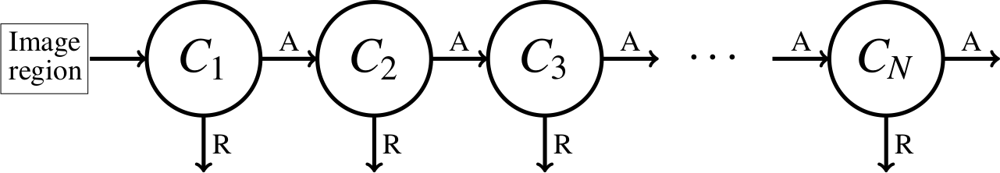

The `pico.js` JavaScript library enables the detection of faces in images.

Highlights of the library:

* open-source code: <https://github.com/nenadmarkus/picojs>;
* has real-time detection capabilities (200+ FPS in a practical setting): see [webcam demo](demo/);
* just 2kB when minified.

## Introduction

We introduce `pico.js`, a face-detection library written in JavaScript, and show how it works.
Although similar projects already exist, our goal is to provide a smaller and computationally more efficient alternative.

Before diving into details, you are encouraged to try a [real-time demo](demo/) that detects faces in a video stream provided by a webcam attached to your computer
(works on mobile devices as well).
Note that all the processing is done on the client side, i.e., without sending images to a server.
So you do not have to worry about privacy issues when running this code.

In the following text we explain the theoretical background and show how `pico.js` works.

## The `pico` object-detection framework

The `pico.js` library is a JavaScript implementation of the method described in [2013 by Markuš et al.](http://arxiv.org/abs/1305.4537) in a technical report.
The reference implementation is written in C and available on GitHub: <https://github.com/nenadmarkus/pico>.
We follow this implementaion closely as we do not intend to replicate the learning process, just the runtime.
The reasoning behind this is that we are better off by learning a detector with the official code,
load it into JavaScript and do the runtime processing there as this offers some unique advantages
(such as great portability across various operating systems and devices).

The `pico` object-detection framework is a modification of the popular [Viola-Jones approach](https://en.wikipedia.org/wiki/Viola%E2%80%93Jones_object_detection_framework).

The Viola-Jones method is based on the concept of region-based classification.
This means that a [classifier](https://en.wikipedia.org/wiki/Statistical_classification) is applied at every reasonable position and scale of an image.
A visualization of this region-enumeration process is visualized in the next figure:
<center>
<figure>

<figcaption>
	Image taken from <a href="https://www.pyimagesearch.com">pyimagesearch</a>.
</figcaption>
</figure>
</center>

The classifier tries to tell whether a face is present in the current region or not.
At the end of this process, the obtained face regions are grouped into clusters based on their overlap.
Due to *many* regions present in each image, real-time processing is achieved with two clever tricks:

1. the classifier is organized as a [classification cascade](https://en.wikipedia.org/wiki/Cascading_classifiers);
2. each member of the cascade can be evaluated in $$O(1)$$ time with respect to the size of the region.

The classification cascade consists of a sequence of classifiers.
Each of these classifiers correctly identifies almost all faces and discards a fraction of non-face regions.
An image region is accepted as a face if it passes *all* the members of the cascade.
Thus, heavy processing (running the whole cascade) is done only on a relatively small number of regions.
This effect is amplified even further by making (by design) earlier classifiers in the sequence more simple than the later ones.
The cascaded-classification algorithm is illustrated in the following image:
<center>
<figure>

<figcaption>
	Each stage contains a classifier $$C_n$$ that can either reject an image region (R) or accept it (A).
	When rejected, the region is not processed by further members of the cascade.
	If none of the classifiers reject the region, we consider it to be a face.
</figcaption>
</figure>
</center>

In the Viola-Jones framework, each classifier $$C_n$$ is based on [Haar-like features](https://en.wikipedia.org/wiki/Haar-like_feature).
This enables $$O(1)$$ evaluation time per region using a precomputed structure known as an [integral image](https://en.wikipedia.org/wiki/Summed-area_table).

However, integral images have some downsides.
The most obvious one is that this data structure requires additional memory to store:
usually 4 times as much as an `uint8` input image.
Additional issue is the time needed to construct an integral image
(also proportinal to the number of pixel in input).
This may be problematic for large images that require processing on small hardware with limited capabilities.
A more nuanced issue with the approach is its elegance:
a natural question is if we can make a framework that does not require such a structure and has all the important properties.

The `pico` framework replaces Haar-like features in each classfier $$C_n$$ with pixel-comparison tests of the following form:

$$
\text{bintest}(R, x_1, y_1, x_2, y_2)=
\begin{cases}
	1	&	R[x_1, y_1]\leq R[x_2, y_2]\\
	0	&	\text{otherwise}
\end{cases}
$$

where $$R$$ is an image region and $$(x_i, y_i)$$ represent the locations at which to compare the pixel values.
Notice that such a test can be applied to regions of various sizes without any specialized data structure, unlike Haar-like features.
This is achieved by storing the locations $$(x_i, y_i)$$ in normalized coordinates
(i.e., $$(x_i, y_i)$$ is in $$[-1, 1]\times[-1, 1]$$) and multiplying them by the scale of the current region.
This is the idea that enables the multiscale detection capabilities of `pico`.

Because of the simplicity of such tests and potential problems with aliasing and noise,
it is necessary to apply a large number of them to the region in order to reason about its contents.
In the `pico` framework, this is achieved by

1. combining the tests into [decision trees](https://en.wikipedia.org/wiki/Decision_tree_learning) and
2. having multiple such trees form cascade members $$C_n$$ by summing their outputs.

This can be written in mathematical notation as follows:

$$
	C_n( R )=
	\sum_{t=1}^{t_n} T_t( R ),
$$

where $$T_t( R )$$ represents the scalar output produced by the tree $$T_t$$ on the input region $$R$$.
Given that each tree consists of number of pixel-comparison tests that can be resized when needed,
it follows that the computational complexity of running a classification stage $$C_n$$ is independent of the region size.

The trees within each $$C_n$$ are learned with a variant of [AdaBoost](https://en.wikipedia.org/wiki/AdaBoost).
Next, a threshold is set to the output of $$C_n$$ in such a way to achieve the desired *true positive rate* (e.g., $$0.995$$).
All regions with scores bellow this threshold are not considered to be faces.
New members of the cascade are added until a desired *false positive rate* is achieved.
See the [original publication](https://arxiv.org/pdf/1305.4537.pdf) for details about the learning process.

As already mentioned in the intoroduction, we will not be replicating the learning code of `pico`, just the runtime.
If you would like to learn a custom object/face detector, please do this with the [official implementation](https://github.com/nenadmarkus/pico).
The `pico.js` is capable of loading the binary cascade files and efficiently processing images with them.
The next subsections explain how to use `pico.js` to detect faces in images.

### Components of `pico.js`

The library has the following components:

* the procedure to instantiate the region-classification function from the cascade data;
* the procedure to run this classifier across an image to detect faces;
* the procedure to cluster the obtained detections;
* the temporal-memory module.

These become available after you include `<script src="pico.js"></script>` (or its minified version) and do some preprocessing.
We will go through the JS code that does face detection in an image
(the code in the [GitHub repo](https://github.com/nenadmarkus/picojs)).
Hopefully, this will sufficiently clarify how to use the library.
The [real-time demo](demo/) works in a simmilar manner.

#### Instantiating the region classifier

The region classifier should discern whether an image region is a face or not.
The idea is to run this classifier across the whole image to obtain all the faces within it
(details later).
In `pico.js`, the region-classification process is wrapped in a function with the following prototype:

```
function(r, c, s, pixels, ldim) {
	/*
		...
	*/
}
```

The first three parameters (`r`, `c` and `s`) specify the position of the region (row and column of its center) and its size.
The `pixels` array contains the gray intensity values of the image.
The parameter `ldim` tells us how to move from one row of the image to the next (known as *stride* in some other libraries, such as OpenCV).
In other words, the code to access the pixel intensity at position (`r`, `c`) is `pixels[r*ldim + c]`.
The function should return a single float value representing the score of the region.
If the score is greater than or equal to `0.0`, the region is interpreted as a face.
If the score is below `0.0`, then the region is interpreted as a non-face, i.e., belonging to the background class.

The `pico.js` procedure `pico.unpack_cascade` takes as an argument the binary representation of the cascade, unpacks it and returns a function closure with the classification process and classifier data wrapped within it.
We use it to initialize the region-classification process.
Details follow.

The face-detection cascade of official `pico` is called `facefinder`.
It consists of approximately 450 decision trees, each with depth equal to 6, organized into a 25-stage cascade.
We will use this cascade in our experiments.
This cascade is able to process images in real time at a reasonable detection rate for frontal faces, as is demonstrated in the [demo](demo/).

The `facefinder` cascade can be downloaded directly from the official github repository using the following snippet:

```
var facefinder_classify_region = function(r, c, s, pixels, ldim) {return -1.0;};
var cascadeurl = 'https://raw.githubusercontent.com/nenadmarkus/pico/c2e81f9d23cc11d1a612fd21e4f9de0921a5d0d9/rnt/cascades/facefinder';
fetch(cascadeurl).then(function(response) {
	response.arrayBuffer().then(function(buffer) {
		var bytes = new Int8Array(buffer);
		facefinder_classify_region = pico.unpack_cascade(bytes);
		console.log('* cascade loaded');
	})
})
```

First, the `facefinder_classify_region` was initialized in such a way to interpret any image region as a non-face (it always returns `-1.0`).
Next, we used the Fetch API to get the cascade binary data from `cascadeurl` URL.
This is an asynchronous call and we do not get the data immediately.
Finally, after the reponse data arrives, it is interpreted as an `int8` array and passed to the `pico.unpack_cascade` procedure which then generates the correct version of the `facefinder_classify_region` function.

The `facefinder_classify_region` function is applied to every region of reasonable position and scale within an image to find all the faces.
This process is explained in the next subsection.

#### Running the classifier across an image

We assume that inside the HTML body tag we have a [canvas element](https://developer.mozilla.org/en-US/docs/Web/API/Canvas_API/Tutorial), an image and a button with an onclick callback.
The detection process starts once the user clicks a button `Detect faces`.

The following JS code prepares the drawing context, draws the image and fetches the raw pixel values (in the red, green, blue + alpha format):

```
var img = document.getElementById('image');
var ctx = document.getElementById('canvas').getContext('2d');
ctx.drawImage(img, 0, 0);
var rgba = ctx.getImageData(0, 0, 480, 360).data; // the size of the image is 480x360 (width x height)
```

Next, we write a helper function that transforms an input RGBA array into grayscale:

```
function rgba_to_grayscale(rgba, nrows, ncols) {
	var gray = new Uint8Array(nrows*ncols);
	for(var r=0; r<nrows; ++r)
		for(var c=0; c<ncols; ++c)
			// gray = 0.2*red + 0.7*green + 0.1*blue
			gray[r*ncols + c] = (2*rgba[r*4*ncols+4*c+0]+7*rgba[r*4*ncols+4*c+1]+1*rgba[r*4*ncols+4*c+2])/10;
	return gray;
}
```

Now we are prepared to invoke the procedure that will run the `facefinder_classify_region` function across the image:

```
image = {
	"pixels": rgba_to_grayscale(rgba, 360, 480),
	"nrows": 360,
	"ncols": 480,
	"ldim": 480
}
params = {
	"shiftfactor": 0.1, // move the detection window by 10% of its size
	"minsize": 20,      // minimum size of a face
	"maxsize": 1000,    // maximum size of a face
	"scalefactor": 1.1  // for multiscale processing: resize the detection window by 10% when moving to the higher scale
}
// run the cascade over the image
// dets is an array that contains (r, c, s, q) quadruplets
// (representing row, column, scale and detection score)
dets = pico.run_cascade(image, facefinder_classify_region, params);
```

Notice that the minimum size of a face was set to $$20$$.
This is unnecessarily small for most applications.
Note that the processing speed heavily depends of this parameter.
For real-time applications, you should set this value to, e.g., $$100$$.
However, the set minimum size is appropriate for our example image.

After the detection process finishes, the array `dets` contains quadruplets of the form $$(r, c, s, q)$$, where $$r$$, $$c$$ and $$s$$ specify the position (row, column) and size of face region, and $$q$$ represents the detection score.
The higher the score of the region, the more likely it is a face.

We can render the obtained detection results onto the canvas:

```
qthresh = 5.0
for(i=0; i<dets.length; ++i)
	// check the detection score
	// if it's above the threshold, draw it
	if(dets[i][3]>qthresh)
	{
		ctx.beginPath();
		ctx.arc(dets[i][1], dets[i][0], dets[i][2]/2, 0, 2*Math.PI, false);
		ctx.lineWidth = 3;
		ctx.strokeStyle = 'red';
		ctx.stroke();
	}
```

The variable `qthresh` needs to be set empirically
(the value 5.0 works OK for the `facefinder` cascade and face detection in still images).
Typical detection results look something like this:

<center>
<figure>

</figure>
</center>

We can see that there are multiple detections around each face.
This issue is solved with non-maximum suppression, which is explained in the next subsection.

#### Non-maximum suppression (clustering) of raw detections

The goal of clustering through non-maximum suppression is to merge together overlapping face regions.
The representative of each cluster is the detection within it that has the highest score (hence the name of the approach).
Its score is updated to the sum of all the detection scores within the cluster.

In `pico.js`, this is achieved as follows:

```
dets = pico.cluster_detections(dets, 0.2); // set IoU threshold to 0.2
```

The IoU threshold was set to `0.2`.
This means that two detections with overlap greater than that value are merged together.

The results now look like this:

<center>
<figure>

</figure>
</center>

We have gone through the basics of using `pico.js` for the detection of faces in still images.
Note that the `pico` method is not as powerful as modern face detectors based on deep learning.
However, `pico` is quite fast and this makes it a good first choice for a wide range of applications, such as those requiring real-time processing.

#### Using `pico.js` for real-time face detection in a video

Since the detections produced by `pico.js` are quite noisy, we developed a temporal-memory module that reduces this problem when processing real-time videos.
This method is used in the mentioned [real-time demo](demo/) to significantly improve the subjective detection quality.

The idea is to combine detections from several consecutive frames in order to increase the confidence that a given region is a face.
This is achieved by instantiating a circualr buffer that holds detections from the last $$f$$ frames:

```
var update_memory = pico.instantiate_detection_memory(5); // f is set to 5 in this example
```

The `update_memory` closure encapsulates the circualr buffer and code to update it.
The returned array contains the detections from last $$f$$ frames.

Now instead of clustering detections from a single frame, we accumulate them prior to clustering:

```
dets = pico.run_cascade(image, facefinder_classify_region, params);
dets = update_memory(dets); // accumulates detections from last f frames
dets = pico.cluster_detections(dets, 0.2); // set IoU threshold to 0.2
```

The final classification threshold, `qthresh`, can now be significantly increased to reduce the number of false positives without significantly affecting the true-positive rate.

## Final notes

The reader is encouraged to look at the HTML code of the demo if there are further ambiguities on how to use the library.

The source code of the library is available on GitHub: <https://github.com/nenadmarkus/picojs>.
Please consider giving the repo a star if you like this work.
This will increase its popularity and encourage similar computer-vision projects.
