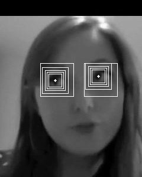
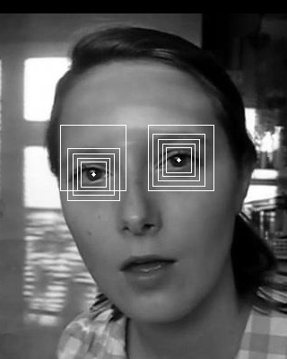

We describe a JavaScript implementation of the method presented in the following paper:

<p>
<i>N. Markus, M. Frljak, I. S. Pandzic, J. Ahnlberg and R. Forchheimer</i><br/>
<b>Eye pupil localization with an ensemble of randomized trees</b>, Pattern Recognition, 2014<br/>
</p>

A real-time demo that runs in web browsers is available [here](demo/).

The code is open-source (released under the MIT license) and available on GitHub: <https://github.com/nenadmarkus/picojs>.

## Introduction

Accurate and fast software for eye-pupil localizations potentially leads to a wide range of applications.
Some areas that can benefit from pupil locations and movements include:

* biometric systems;
* human-machine interfaces;
* computer-based gaze and eye-focus estimation;
* model-based compression of face videos;
* analysis of human attention for marketing and advertising purposes.

A thorough survey of various methods and applications of eye and gaze tracking can be found in the following paper:
[In the Eye of the Beholder: A Survey of Models for Eyes and Gaze](https://doi.org/10.1109/TPAMI.2009.30).
We recommend this work for a more comprehensive introduction to the subject.

In this post we describe our implementation of a very simple yet versatille method for eye-pupil localization.
The details are given in the following two sections.
In the end, we give a short summary of possible future work directions and discuss modern (yet computationally heavy) approaches to keypoint localization which could be applied to eye localization.

## The method

We assume that the approximate locations of the eyes are known and that we can extract rectangular regions that contain them.
Nowadays this does not pose a problem since accurate and efficient face detectors exist.
In our experiments and implementation, we use [pico](https://github.com/nenadmarkus/pico) for this initial task.
Next, the logical next step is to treat the eye-pupil localization as a [regression problem](https://en.wikipedia.org/wiki/Regression_analysis):
use an ensemble of [decision trees](https://en.wikipedia.org/wiki/Decision_tree_learning) to estimate the coordiantes of the pupil when input an image region containing an eye.
Unfortunately, this simple approach does not lead to satisfactory results, as was shown in the original publication.
However, when the regression problem is decomposed into several steps, the localization task can be solved to sufficient accuracy.
The most important components and experiments are described in the next few sections.

### The configuration of tree ensembles

To make the method fast, its basic component, a decision tree, needs to swiftly process the image pixels.
Thus, it is beneficial to use the trick from [pico](../picojs-intro) here as well:
we use binary trees with pixel-comparison tests in internal nodes:

$$
\text{bintest}(R, x_1, y_1, x_2, y_2)=
\begin{cases}
	1	&	R[x_1, y_1] > R[x_2, y_2]\\
	0	&	\text{otherwise}
\end{cases}
$$

where $R$ is an image region and $(x_i, y_i)$ are the locations within this region at which to compare the pixel values.
The values $(x_i, y_i)$ are stored in normalized coordinates to enable resolution independence
(absolute coordinates are obtained by multiplying normalized values with the size of the region).
Note that such configuration of decision trees is relatively common in computer vision
(e.g., it is used in the [Microsoft Kinect device](https://www.microsoft.com/en-us/research/wp-content/uploads/2016/02/BodyPartRecognition.pdf) and [pico.js](../picojs-intro)).
However, in our case, we use regression trees (and their ensembles):
instead of a class label, leaf nodes of our trees contain 2D vectors that are interpreted as offsets to the eye-pupil location.

The values $x_1, y_1, x_2, y_2$ in internal nodes and 2D offsets in leaf nodes are determined during the training process.
The training data for each tree is a large set of input-output pairs of the following form:

$$
\{
(R_1, \mathbf{o}_1),
(R_2, \mathbf{o}_2),
\ldots,
(R_N, \mathbf{o}_N)
\},
$$

where $R_n$ and $\mathbf{o}_n$ represent the $n$th eye region with its associated eye-pupil location offsets in normalized coordinates.
As is usually the case, each tree is learned top-down in a greedy manner through a process called [variance reduction](https://en.wikipedia.org/wiki/Decision_tree_learning#Variance_reduction).
The parameters $x_1, y_1, x_2, y_2$ of each binary test in internal nodes of the tree are selected in a way to maximize clustering quality obtained when the incoming training data is split by the test.
Since the number of possible tests is prohibitively large and the optimization criterion cannot be solved using gradient-based methods, randomized sampling is used:
several eligible tests are generated at random and the one is selected that leads to the best split of the training data.
The training data is recursively clustered in this fashion until a predefined depth of the tree is reached.
This strategy reduces both the training time and storage requirements.
The vector stored in each leaf node is set to be the average of all offsets that arrived at that node.

Since we cannot expect a single tree solving our problem to a desired degree of accuracy, we build an ensemble of trees with [gradient boosting](https://en.wikipedia.org/wiki/Gradient_boosting).
However, neither a one large ensemble of trees leads to good results.
This is discussed in the next section, alongside an algorithm that improves on this issue.

### Decomposing the offset estimation into several steps

An empirical observation is that the accuracy and robustness of the method critically depend on the scale of the rectangle within which eye-pupil localization is performed.
If the recnagle is too small, the inherent noise present in the face detector might result that it does not contain the eye.
On the other hand, if the rectangle is too large, the accuracy suffers since even large ensembles of trees manage to only coarsely localize the pupil.

The idea that addresses these issues is to decompose the problem into several stages, as proposed by [Dollar, Welinder and Perona](https://ieeexplore.ieee.org/document/5540094).
This approach has also been used extensively for face alignment (see the paper by [Cao et al.](https://www.microsoft.com/en-us/research/wp-content/uploads/2013/01/Face-Alignment-by-Explicit-Shape-Regression.pdf)).
In our case, we learn multiple tree ensembles, each designed for estimation at a different scale.
These ensembles are applied in a sequential manner, starting with an ensemble learned for largest scale.
The obtained intermediate offsets are used to reposition the rectangle for the next ensemble in the sequence.
This process continues until the last one is reached.
The output of this ensemble is accepted as the final result.
This is illustrated in the following two images:

<center>


</center>

Note that this approach for eye-pupil localization follows prior work in sequential estimation except that it adds the region-scaling component.
This has also been confirmed to be beneficial in the work of [Ren et al.](https://www.cv-foundation.org/openaccess/content_cvpr_2014/html/Ren_Face_Alignment_at_2014_CVPR_paper.html)

### Multiple randomized initialiations improve the localization accuracy

The output of the estimator is noisy and often unreliable, especially if the images are supplied from a low quality camera.
The errors can ultimately be attributed to the simplicity of pixel-comparison tests in the internal nodes of the trees:
the pixel footprint size changes significantly with variations in scale of the eyes and we can expect problems with aliasing.
These issues can be reduced in runtime by multiple random initializations (perturbations).
The idea is to sample multiple rectangular patches at different positions and scales around the eye and estimate the pupil location in each of them.
The resulting pupil coordinate is the median over the detections for each spatial dimension.

See the [original paper](https://across.fer.hr/_download/repository/PR4885.pdf) for the experimental validation of each of the algorithmic components described in this section.

We describe our JavaScript implementation of the method in the next section.

## Implementation

The code that enables learning of regression trees is implemented in C due to efficiency and portability.
We closely follow the recommendations from the original paper.
Thus, our pupil-localizer contains 5 stages, each with 20 trees of depth set to 10.
The shrinkage parameter was set to $0.5$.
The training set consists a couple of thousand face images with manually labeled pupil locations.
The regions around eyes are cropped in such a manner to enable us to use [pico.js](https://github.com/nenadmarkus/picojs) in runtime for the face-localization task.

We implement the runtime part of the method in JavaScript: [lploc.js](demo/lploc.js).
A surprising fact is that this implementation has only around 100 lines of code.
To use the runtime in your code, first include [lploc.js](demo/lploc.js).
Next, initialize the library using the function `unpack_localizer` with the localizer structure (raw bytes) produced by the learning tool described above
(these bytes are assumed to be available at the URL `puplocurl`):

```
fetch(puplocurl).then(function(response) {
	response.arrayBuffer().then(function(buffer) {
		var bytes = new Int8Array(buffer);
		do_puploc = lploc.unpack_localizer(bytes);
		console.log('* puploc loaded');
	})
})
```

The function `do_puploc`, made available by the above code, has the following prototype:

```
function do_puploc(r, c, s, nperturbs, image) {
    ...
}
```

The `r`, `c` and `s` parameters represent the coordinated (row, column, scale/size) of the region within which we would like the localization to be prformed.
The parameter `nperturbs` sets the number of random perturbations to perform on the specified image region.
We recommend to set this number to $15$ or $31$.
The final parameter, `image`, contains the raw image pixels.
See the article on <a href="../picojs-intro/">pico.js</a> for details.

Please see the code of the demo for details as it is thoroughly documented: [demo/index.html](demo/index.html).

## Conclusion

The reader is encouraged to read the <a href="https://across.fer.hr/_download/repository/PR4885.pdf">original paper</a> in which the method was introduced for a more detailed description and experiments.

The training tool definitely requires serious polishing before being released to the public.
We leave this for future work.

An interesting question is whether the accuracy of pupil localization can be increased with a better training set.
There are at least some indications that this would lead to improvements when the more extreme head poses are present, such as large out-of-plane rotations.
Of course, to completely solve such issues, one needs to retrain the face detector as well.

Eye-pupil localization can be solved effectively with convolutional neural networks via heatmap regression.
An example of such methods applied to face alignment and human pose estimation can be found in the following two papers:

* [How far are we from solving the 2D & 3D Face Alignment problem?](https://adrianbulat.com/face-alignment)
* [Human pose estimation via Convolutional Part Heatmap Regression](https://adrianbulat.com/human-pose-estimation)

Methods from this class are both simple, powerful and, thus, popular.
There is no doubt that they lead to higher accuracy and robustness that the presented approach based on decision trees.
However, there is also a question of computational resources.
Running `pico.js` and `lploc.js` requires just a fraction of the computational cost compared to running a convolutional network with, e.g., Tensorflow.
Thus, we hope that the presented implementation finds its use in resource-limited applications.
