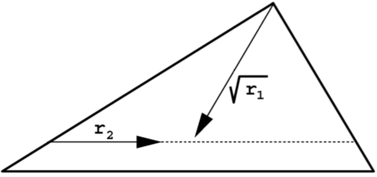
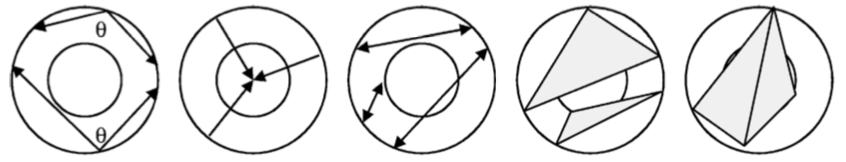

In this post we show how to sample a point cloud on the surface of a 3D mesh and use its geometric properties as a discriminative signature of the mesh.
The original algorithm can be found in the following [paper](http://graphics.stanford.edu/courses/cs468-08-fall/pdf/osada.pdf):

<p>
<i>R. Osada, T. Funkhouser, B. Chazelle, D. Dobkin</i><br/>
<b>Shape Distributions</b>, ACM Transactions on Graphics, 2002<br/>
</p>

## Sampling a point cloud on a 3D mesh

A [point cloud](https://en.wikipedia.org/wiki/Point_cloud) is a set of points in space.
An example is shown here (taken from wikipedia):

<center>

</center>

It is obvious that the distribution of the cloud encodes distinctive properties of the original shape (a torus).

Triangle meshes are the most common virtual representations of objects and scenes for computer games and computer-aided dessign.
Thus, it makes sense to concentrate on this representation.

A point cloud can be obtained from a triangle mesh by iterating the following three steps:

1. choose a triangle with probability proportional to its area (the triangle is defined by vertices $$\mathbf{v}_1$$, $$\mathbf{v}_2$$ and $$\mathbf{v}_3$$);
2. generate two random numbers, $$r_1$$ and $$r_2$$, between $$0$$ and $$1$$;
3. return a point $$\mathbf{p}$$: $$\mathbf{p}=(1 - \sqrt{r_1})\mathbf{v}_1 + \sqrt{r_1}(1 - r_2)\mathbf{v}_2 + \sqrt{r_1}r_2\mathbf{v}_3$$.

The above procedure produces a uniform point cloud on the surface of the mesh.
The distribution of points is not sensitive to the changes in tessellation,
which is a desirable property for practical applications.

The first step is self-explanatory:
triangles with greater area should have more points on them.
We prepare a data structure that makes this sampling process efficient.
This data structure is an array in which each entry is associated with a triangle and contains, among other necessary data, the triangle area (computed using [Heron's formula](https://en.wikipedia.org/wiki/Heron%27s_formula)) along with the cumulative area of triangles visited before.
A random triangle is now selected with probability proportional to its area by generating a random number between $$0$$ and the total cumulative area and performing a binary search on the array of cumulative areas.

The second and third step describe how to uniformly sample a point within a given triangle.
The intuition is as follows.
The value $$\sqrt{r_1}$$ sets the distance from the vertex $$\mathbf{v}_1$$ to the opposing edge of the triangle.
The value $$r_2$$ interpolates along that edge between $$\mathbf{v}_2$$ and $$\mathbf{v}_3$$.
The square root of $$r_1$$ is needed to correctly take into consideration the surface area.
The whole process is illustrated in the following image.

<center>

</center>

### Implementation

The core algorithm is implemented in C: [ptsampler.c](ptsampler.c).

We test the implementation with [off.py](off.py), a demo script written in Python.
This script compiles the C file as a shared library and uses `ctypes` to access its functionality.
The script expects two command-line arguments.
The first one is the path to a OFF 3D mesh:
<https://en.wikipedia.org/wiki/OFF_(file_format)>.
The current limitation is that only triangular meshes are supported.
The second required command-line argument is the path to a file in which the sampled points will be written.
Sample usage:

	python off.py model.off output.txt

Suitable OFF models can be obtained from the McGill 3D Shape Benchmark: <http://www.cim.mcgill.ca/~shape/benchMark/>.

## Shape distributions

The described sampling algorithm was used by [Osada et al.](http://graphics.stanford.edu/courses/cs468-08-fall/pdf/osada.pdf) as a component of their method for measuring the similarity between two 3D shapes.
The idea is to generate a *signature* representing a shape from the properties of its point-cloud distribution.
The primary motivation for this approach is to reduce the shape matching problem to the comparison of probability distributions.
This is simpler than traditional shape matching methods that require pose registration, feature correspondence or model fitting.

The distribution of a point cloud sampled on the surface of a shape can be represented in various manners.
Osada et al. proposed to compute a histogram of values from several types of *shape functions*.
Each of these shape functions takes a tuple of points as input and returns a single value that characterizes the geometrical layout of these points.
The following five were chosen for their simplicity and invariances to rotation and translation:

1. the angle spanned by random three points on the surface;
2. the distance between a fixed point and one random point on the surface;
3. the distance between two random points on the surface;
4. the square root of the area of the triangle between three random points on the surface;
5. the cube root of the volume of the tetrahedron between four random points on the surface.

These are illustrated in the following figure:

<center>

</center>

For a given point cloud, we can compute a histogram (approximated distribution) for each of the mentioned shape functions.
This is achieved by iteratively sampling a tuple of points, passing it into a shape function and incrementing the corresponding histogram bin based on the output
(partial loss of information due to quantization cannot be avoided).
The resulting histogram can be used as a shape signature after the necessary normalization step.
The following code approximates the distribution of distances between pairs of points in a point cloud
(we assume that `P` is a list of `n` points):

```
import random
vals = numpy.zeros(4096)
for i in range(0, len(vals)):
    p1, p2 = random.sample(P, 2)
    vals[i] = numpy.linalg.norm(p1-p2)
vals = vals/numpy.median(vals)
H = numpy.histogram(vals, bins=64, range=(0.0, 3.0), density=True)
```

Two histograms can be compared, for example, using the [Bhattacharyya distance](https://en.wikipedia.org/wiki/Bhattacharyya_distance).
A simpler solution is to simply use the $$\ell_1$$ norm:

```
numpy.sum(numpy.abs(H1 - H2))
```

Please see the original publication for numerical results of 3D shape-retrieval experiemnts.

## Conclusion

We have explained and implemented the procedure of sampling a point cloud on the surface of a 3D shape represented as a triangle mesh.
The geometrical distribution of points in this point cloud can be used as an invariant and robust signature for the retrieval of 3D shapes.
