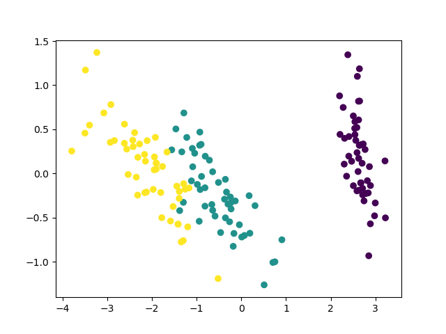

Principal component analysis (abbreviated as PCA in the following text) is a widely used statistical method that enables a simple, nonparametric approach to the extraction of relevant information and features from large datasets (e.g., images, tabular and textual data, representations generated with deep learning, etc.).

Even though a classical, well-known method not considered "hot" in the era of deep learning, we can still see PCA being used in cutting-edge research.
For example, [Saito et al. (SIGGRAPH Asia 2018)](https://www.youtube.com/watch?v=UT2EiLG4Mrg) apply it in their pipeline for 3D hair synthesis.
The PCA method also seems to be important in building state-of-the-art image-retrieval engines, as recommended by [Tolias et al.](https://arxiv.org/abs/1511.05879)
(also see the work that cites this paper).
There are numerous other examples as well.

This post gives the basic intuition behind the PCA method by

1. going through a variant of its mathematical derivation;
2. providing and efficient numpy implementation;
3. testing the implementation on a toy dataset and
4. listing some of its limitations.

For a different perspective, the reader is encouraged to read the [Wikipedia article](https://en.wikipedia.org/wiki/Principal_component_analysis) or the tutorial available on arXiv: <https://arxiv.org/abs/1404.1100>.

In the next section, we derive the PCA method as a sequential process of choosing projecting directions that maximise the dispersion of the projected data.

## Selecting projection directions that maximize variance

Let $$\mathbf{x}$$ be a random vector with $$N$$ dimensions.
As $$N$$ is often not a small number in practice, it is beneficial to reduce the dimensionality of $$\mathbf{x}$$.
In other words, we would like to compress the random vector, i.e., represent all the information it conveys in a more compact manner.
Under some assumptions, variance can be seen as a measure of information contained in a random variable.
An advantage of using variance is that it can easily be computed with the use of simple linear algebra, as we will see later in the text.
The core strategy of PCA is to find a set of directions on which to project the data such that:

* the variance of each projection is maximized;
* the projections are [uncorrelated](https://en.wikipedia.org/wiki/Uncorrelated_random_variables).

Let us compute the variance of a random variable obtained by projecting $$\mathbf{x}$$ onto a direction represented by the vector $$\mathbf{v}$$.
By definition, this variance is equal to
($$\mathbb{E}$$ denotes the [expectation operator](https://en.wikipedia.org/wiki/Expected_value))

$$
	\sigma^2=
	\mathbb{E}\left[\left(\mathbf{v}^T\mathbf{x}-\mathbb{E}\left[\mathbf{v}^T\mathbf{x}\right]\right)^2\right]
$$

By defining $$\mu=\mathbb{E}\left[\mathbf{x}\right]$$, noting that $$\mathbf{v}^T\mathbf{x}=\mathbf{x}^T\mathbf{v}$$ and using the linearity of the expectation operator $$\mathbb{E}$$, we easily arive to the following conclusion:

$$
	\sigma^2=
	\mathbf{v}^T\mathbb{E}\left[\left(\mathbf{x}-\mathbf{\mu}\right)\left(\mathbf{x}-\mathbf{\mu}\right)^T\right]\mathbf{v}=
	\mathbf{v}^T\mathbf{\Sigma} \mathbf{v}
$$

We can see that the variance of the projection depends on the [covariance matrix](https://en.wikipedia.org/wiki/Covariance_matrix) $$\mathbf{\Sigma}$$ of vector $$\mathbf{x}$$.

We use the method of [Lagrange multipliers](https://en.wikipedia.org/wiki/Lagrange_multiplier) to solve our problem of finding directions that maximize the projectin variance.
Note that we need to use Lagrange multipliers since we place constraints on the solution we want to obtain:
to obtain the first direction, we need to find a vector $$\mathbf{v}$$ that maximizes $$\mathbf{v}^T\mathbf{\Sigma}\mathbf{v}$$ and has unit length, i.e., $$\mathbf{v}^T\mathbf{v}=1$$
(we are not interested in the  length of this vector, just its direction).
We now write the Lagrange function ($$\lambda$$ is the multiplier associated with the constraint $$\mathbf{v}^T\mathbf{v}=1$$):

$$
	L=
	\mathbf{v}^T\mathbf{\Sigma}\mathbf{v} - \lambda(\mathbf{v}^T\mathbf{v}-1)
$$

We seek its critical points to find the desired solution:

$$
	\frac{\partial L}{\partial\mathbf{v}}=
	\mathbf{0}
	\;\;\Rightarrow\;\;
	\mathbf{\Sigma}\mathbf{v}=
	\lambda\mathbf{v}
$$

(since $$\mathbf{\Sigma}$$ is symmetric, $$\frac{\partial}{\partial\mathbf{v}}\mathbf{v}^T\mathbf{\Sigma}\mathbf{v}=\mathbf{\Sigma}\mathbf{v}$$).

From the above analysis we can see that our problem comes down to seeking [eigenvalues and eigenvectors](https://en.wikipedia.org/wiki/Eigenvalues_and_eigenvectors) of $$\mathbf{\Sigma}$$.
In the general case, $$\mathbf{\Sigma}$$ has $$N$$ distinct eigenvectors and eigenvalues.
Which one is the solution we seek?
Let us find out by calcualting the variance directly:

$$
	\sigma^2=
	\mathbb{E}\left[\left(\mathbf{v}^T\mathbf{x}-\mathbb{E}\left[\mathbf{v}^T\mathbf{x}\right]\right)^2\right]=
	\mathbf{v}^T\mathbf{\Sigma} \mathbf{v}=
	\mathbf{v}^T\lambda \mathbf{v}=
	\lambda \mathbf{v}^T \mathbf{v}=
	\lambda
$$

We can see that the variance is maximized if we choose the unit eigenvector that corresponds to the largest eigenvalue of $$\mathbf{\Sigma}$$.
Let us denote these as $$\mathbf{v}_1$$ and $$\lambda_1$$.

Usually we cannot represent the data sufficiently good with just one projection.
Thus, we need to find the procedure for computing the next projection directions $$\mathbf{v}_2, \mathbf{v}_3, \ldots$$ that satisfy our requirements.
The next projection should be uncorrelated to $$\mathbf{v}_1^T\mathbf{x}$$, i.e.,

$$
	\mathbb{E}
	\left[
		\left( \mathbf{v}_1^T\mathbf{x}-\mathbb{E}\left[\mathbf{v}_1^T\mathbf{x}\right] \right)
		\left( \mathbf{v}_2^T\mathbf{x}-\mathbb{E}\left[\mathbf{v}_2^T\mathbf{x}\right] \right)
	\right]=
	0
$$

After simplification, we get the following equality:

$$
	\mathbf{v}_2^T\mathbf{\Sigma} \mathbf{v}_1=
	0
$$

Furthermore, substituting $$\mathbf{\Sigma}\mathbf{v}_1$$ with $$\lambda_1\mathbf{v}_1$$, we obtain that

$$
	\mathbf{v}_2^T\mathbf{v}_1=
	0
$$

i.e., the uncorrelatedness of projections means that the projection directions are orthogonal.

To find $$\mathbf{v}_2$$, we write another Lagrange function, this time with two multipliers ($$\lambda$$ pertaining to the unit-length constraint and $$\phi$$ to orthogonality with $$\mathbf{v}_1$$):

$$
	L=
	\mathbf{v}^T\mathbf{\Sigma} \mathbf{v} - \lambda\left(\mathbf{v}^T\mathbf{v}-1\right) - \phi\;\mathbf{v}^T\mathbf{v}_1
$$

If we equate $$\partial L/\partial \mathbf{v}$$ with zero, we get

$$
	\mathbf{\Sigma} \mathbf{v} - \lambda\mathbf{v} - \phi\mathbf{v}_1=
	\mathbf{0}
$$

Next, multiplying the above expression with $$\mathbf{v}_1^T\cdot$$ leads to

$$
	\mathbf{v}_1^T\mathbf{\Sigma} \mathbf{v} - \lambda\mathbf{v}_1^T\mathbf{v} - \phi\mathbf{v}_1^T\mathbf{v}_1=
	0
$$

Since from our former analysis we know that $$\mathbf{v}_1^T\mathbf{\Sigma} \mathbf{v}=0$$ and $$\mathbf{v}_1^T\mathbf{v}=0$$, it follows that $$\phi=0$$.
This conclusion leads us again to $$\mathbf{\Sigma} \mathbf{v}=\lambda\mathbf{v}$$ and we choose $$\mathbf{v}_2$$ as an eigenvector of $$\mathbf{\Sigma}$$ that corresponds to its second largest eigenvalue $$\lambda_2$$.

The next projection vectors $$\mathbf{v}_3, \mathbf{v}_4, \mathbf{v}_5, \ldots$$ can be obtained by choosing eigenvectors of $$\mathbf{\Sigma}$$ that correspond to eigenvalues $$\lambda_3, \lambda_4, \lambda_5, \ldots$$ such that $$\lambda_1 \ge \lambda_2 \ge \lambda_3 \ge \ldots$$
Note that since the covariance matrix $$\mathbf{\Sigma}$$ is symmetric, its eigenvectors are orthogonal --- just as required.

## Estimating the PCA compression error

The eigenvectors of the covariance matrix $$\mathbf{\Sigma}$$ span the whole $$N$$-dimensional space since $$\mathbf{\Sigma}$$ is symmetric and positive definite.
Thus, we can represent $$\mathbf{x}$$ as

$$
	\mathbf{x}-\mathbf{\mu}=
	\sum_{n=1}^{N}\left( \mathbf{v}_n^T (\mathbf{x}-\mathbf{\mu}) \right)\mathbf{v}_n
$$

Its approximation with the first $$N' < N$$ components is

$$
	\mathbf{x}-\mathbf{\mu}\approx
	\sum_{n=1}^{N'}\left( \mathbf{v}_n^T (\mathbf{x}-\mathbf{\mu}) \right)\mathbf{v}_n
$$

We now compute the expected apprioximation error:

$$
	\epsilon^2=
	\mathbb{E}
	\left[
		\left\|
			\sum_{n=1}^{N}\left( \mathbf{v}_n^T (\mathbf{x}-\mathbf{\mu}) \right)\mathbf{v}_n
			- \sum_{n=1}^{N'}\left( \mathbf{v}_n^T (\mathbf{x}-\mathbf{\mu}) \right)\mathbf{v}_n
		\right\|^2
	\right]
$$

After simplifying the above expression, we get

$$
	\epsilon^2=
	\lambda_{N'+1} + \lambda_{N'+2} + \ldots + \lambda_N
$$

i.e., the expected error is equal to the sum of the smallest $$N-N'$$ eigenvalues.
This serves as another justification for the presented derivation of the PCA procedure.

## Using PCA in practice

In practice we do not work with random vectors.
Instead, we work with independent realizations sampled from the distribution specified by the random vector.
Let $$\mathbf{x}_1, \mathbf{x}_2. \mathbf{x}_3, \ldots, \mathbf{x}_M$$ be such realizations of $$\mathbf{x}$$.
We can reason about the statistical properties of $$\mathbf{x}$$ by processing these samples.

Tese are the steps to compress the feature space from $$N$$ to $$N'$$ dimensions with PCA:

1. estimate the expected value (mean) of $$\mathbf{x}$$:

$$
	\mathbf{\hat{\mu}}=
	\frac{1}{M}\sum_{m=1}^{M}\mathbf{x}_m
$$

2. estimate the covariance matrix of $$\mathbf{x}$$:

$$
	\mathbf{\hat{\Sigma}}=
	\frac{1}{M-1}\sum_{m=1}^{M}(\mathbf{x}_m-\mathbf{\hat{\mu}})(\mathbf{x}_m-\mathbf{\hat{\mu}})^T
$$

(note that we are using an [unbiased estimator](https://en.wikipedia.org/wiki/Estimation_of_covariance_matrices) here, which may not be that important in practice)

3. compute the eigenvectors of $$\mathbf{\hat{\Sigma}}$$ that correspond to the top $$N'$$ eigenvalues and normalize them to unit length
($$\mathbf{v}_1$$ corresponds to the largest eigenvalue, $$\mathbf{v}_2$$ to the second largest, etc.)
4. finally, construct the projection matrix by stacking the computed eigenvectors:

$$
	\mathbf{V}=
	\left(\mathbf{v}_1, \mathbf{v}_2, \ldots, \mathbf{v}_{N'}\right)
	\in\mathbb{R}^{N\times N'}
$$

The projection of each new sample $$\mathbf{x}'$$ can be obtained as follows:

$$
	\mathbf{y}'=
	\mathbf{V}^T(\mathbf{x}'-\mathbf{\hat{\mu}})
$$

The dimension of $$\mathbf{y}'$$ is $$N'$$.
We also hope that the projection process has filtered out some noise that would potentially harm our reasoning about the data.

The problematic part of the presented algorithm are the large computational resources needed for extracting eigenvalues and eigenvectors of $$\mathbf{\Sigma}$$.
In general, this procedure scales as $$O(N^3)$$ (additinal details available at [wikipedia](https://en.wikipedia.org/wiki/Eigenvalue_algorithm)),
which is pretty bad even when $$N$$ is around $$10\;000$$.
Also, the cost of computing $$\mathbf{\hat{\Sigma}}$$ scales as $$M\cdot N^2$$.
This can be even worse since $$M$$ is often much larger than $$N$$.
However, we can solve this issue by subsampling:
we compute $$\mathbf{\hat{\Sigma}}$$ just on $$M' < M$$ samples.

Modern numerical software (e.g., [LAPACK](https://en.wikipedia.org/wiki/LAPACK)) is reliable, accurate and fast.
However, in some circumstances we can reduce the required computation by exploiting some special properties of our data analysis problem.
One such case is the situation where $$M < N$$, i.e., $$\mathbf{x}$$ has more dimensions, $$N$$, than there are available samples, $$M$$, from the distribution specified by $$\mathbf{x}$$.
This, for example, might arise in an document-retrieval datasets, where individual documents are represented by large sparse vectors.
The next subsection we describe how to efficiently deal with such problems.

### The case when $$M < N$$

In the case when $$M < N$$, we have less samples than there are dimensions of our data points.
Consequently, there is a trick that reduces the amount of computation required for performing PCA.

It is convenient to define the following matrix for our further analysis:

$$
	\mathbf{X}=
	(\mathbf{x}_1-\mathbf{\hat{\mu}}, \mathbf{x}_2-\mathbf{\hat{\mu}}, \ldots, \mathbf{x}_M-\mathbf{\hat{\mu}})^T\in
	\mathbb{R}^{M\times N}
$$

We can easily check that the following holds:

$$
	\mathbf{\hat{\Sigma}}=
	\frac{1}{M-1}\mathbf{X}^T\mathbf{X}
$$

Furthermore, matrices $$\mathbf{X}^T\mathbf{X}$$ and $$\mathbf{X}\mathbf{X}^T$$ have the same set of non-zero eigenvalues.
This is not hard to proove.
Let $$\lambda > 0$$ be the eigenvalue of $$\mathbf{X}\mathbf{X}^T$$ and $$\mathbf{v}\neq\mathbf{0}$$ its eigenvector, i.e., $$\mathbf{X}\mathbf{X}^T\mathbf{v}=\lambda\mathbf{v}$$.
If we multiply this expression by $$\mathbf{X}^T$$, we get

$$
	\mathbf{X}^T\mathbf{X}\mathbf{X}^T\mathbf{v}=\lambda\mathbf{X}^T\mathbf{v}
$$

We see that, by definition, $$\lambda$$ is also an eigenvalue of $$\mathbf{X}^T\mathbf{X}$$ with $$\mathbf{X}^T\mathbf{v}$$ as the corresponding eigenvector
(we know that $$\mathbf{X}^T\mathbf{v}\neq\mathbf{0}$$ since otherwise this would imply $$\lambda\mathbf{v}=\mathbf{0}$$, i.e., either $$\lambda=0$$ or $$\mathbf{v}=\mathbf{0}$$ --- none of which holds according to our initial assumptions).
The other direction of the proof is similar: we simply swap $$\mathbf{X}$$ and $$\mathbf{X}^T$$.

Thus, if $$M < N$$, it is more computationally efficient to find the eigenvectors of $$\frac{1}{M-1}\mathbf{X}\mathbf{X}^T$$ and then multiply them by $$\mathbf{X}^T$$ to obtain the desired solution.

In the next section we provide an efficient `numpy` implementation of the algorithms discussed so far.

## Implementation in `numpy`

The following Python function takes as argument the `data` matrix representing $$\mathbf{X}$$ and the number of desired projection directions, `projdims`, representing $$N'$$.

```
def do_pca(data, projdims):
	#
	usetransf = data.shape[0] < data.shape[1]
	#
	mean = numpy.mean(data, 0)
	data = data - mean
	if usetransf:
		cov = numpy.matmul(data, data.transpose())/(data.shape[0] - 1)
	else:
		cov = numpy.matmul(data.transpose(), data)/(data.shape[0] - 1)
	#
	eigvals, eigvecs = numpy.linalg.eigh(cov)
	eigvals = eigvals[::-1]
	eigvecs = eigvecs[:, ::-1]
	#
	if usetransf:
		proj = numpy.matmul(data.transpose(), eigvecs[:, 0:projdims])
		# (normalize the projection direction to unit length)
		proj = proj/(1e-6 + numpy.sqrt(numpy.sum(numpy.power(proj, 2), 0)))
	else:
		proj = eigvecs[:, 0:projdims]
	vars = eigvals[0:projdims]
	#
	return mean, proj, vars
```

The resulting arrays that the function returns are the `mean` representing $$\mu$$, `proj` representing $$\mathbf{V}$$ and `vars` representing the first $$N'$$ largest eigenvalues (this is equivalent to the projection variances estimated on the training data).

We test this code on a toy dataset in the next section.

## Test on a toy dataset

We will use the [Iris flower dataset](https://en.wikipedia.org/wiki/Iris_flower_data_set), introduced by the great British statistician and geneticist, [Sir Ronald Fisher](https://en.wikipedia.org/wiki/Ronald_Fisher).

The dataset consists of 50 samples from each of three species of Iris (Iris setosa, Iris virginica and Iris versicolor).
Each sample contains the following four measurements: the length and the width of the sepals and petals, in centimeters.

Due to its simplicity and small size, it is often used to showcase the performance of various statistical algorithms.
We use it here to show how to use our implementation of PCA:

```
import numpy
from sklearn import datasets
import matplotlib.pyplot
 # load the iris dataset
iris = datasets.load_iris()
data = iris['data'].astype(numpy.float32) # a 150x4 matrix with features
labels = iris['target'] # an array with 150 class labels
 # project the features to two dimensions
mean, proj, vars = do_pca(data, 2)
data = numpy.matmul(data-mean, proj)
 # plot the results 8we use class labels for colorization)
matplotlib.pyplot.scatter(data[:, 0], data[:, 1], c=labels)
matplotlib.pyplot.show()
```

The code above produces the following figure:

<center>
<figure>

</figure>
</center>

We can see that different classes are relatively clearly separated.
However, we cannot linearly separate all the classes in the obtained 2D space.
The PCA method is quite popular and useful for such preliminary, exploratory data analysis.
However, it has its limitations.

## Limitations of the PCA method

Note that the applicability of PCA is limited by assumptions made in its derivation.
Some are listed here:

* PCA is a linear projection method and it could fail (e.g., lead you to wrong conclusions) on some datasets;
* variance maximization sometimes does not lead to the desired outcome;
* the results of PCA depend on the scaling of variables in the vector $$\mathbf{x}$$;
* it could be difficult (or impossible) to provide physically meaningful interpretation of generated projections;
* the orthogonality of projection directions can be restrictive as the informative dimensions do not necessarily have to be orthogonal to each other;
* it is potentially computationally demanding to compute.

For a more comprehensive analysis check the [Wikipedia article](https://en.wikipedia.org/wiki/Principal_component_analysis) or the tutorial paper available at [arxiv](https://arxiv.org/abs/1404.1100).

## Conclusion

This blog post introduced the basics of the PCA method, a common first tool in exploratory data analysis, feature extraction and data compression.
The reader is encouraged to explore additional tutorials and articles for a different perspective, with the hope that information obtained here was useful.

Please consider checking out other blog posts at <https://tehnokv.com/posts/> for simialr content or subsribe to twitter feed, [@tehnokv](https://twitter.com/tehnokv), for updates.
