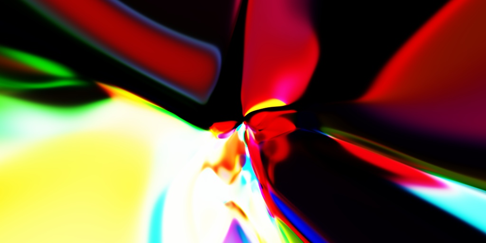
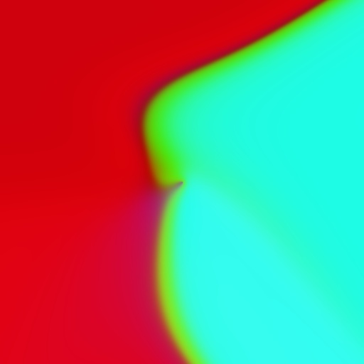
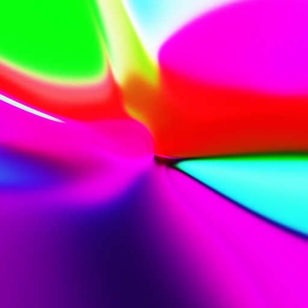
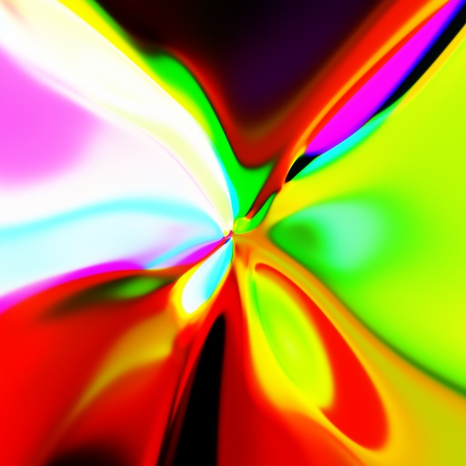
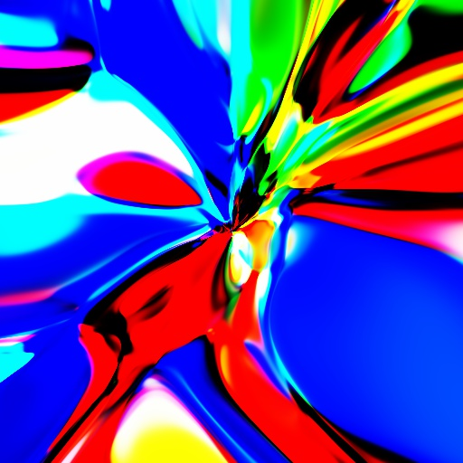
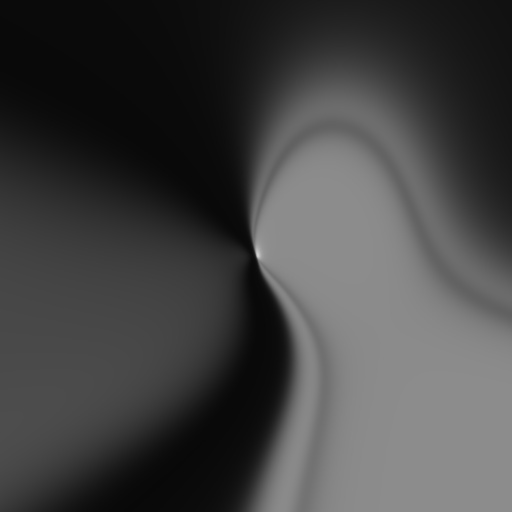
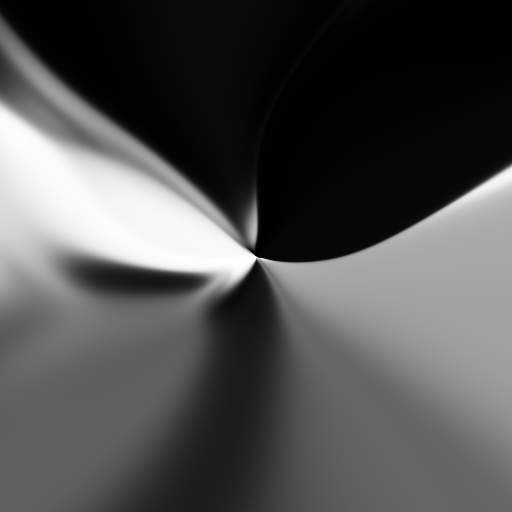
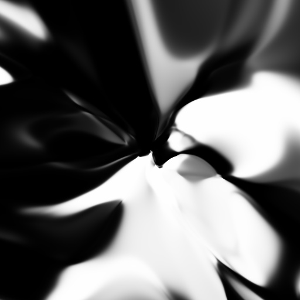
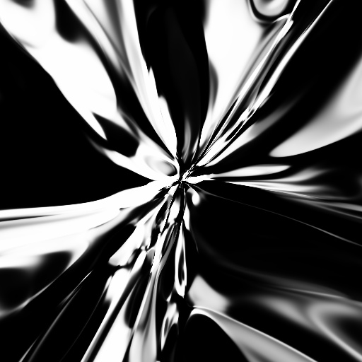

We show how to use the ideas from [compositional pattern-producing networks (CPPNs)](https://en.wikipedia.org/wiki/Compositional_pattern-producing_network) to generate abstract videos out of the frequency spectrum of music and other sounds.

An example visualization can be seen here:

<!--
<div style="text-align:center;">
<iframe src="https://www.youtube-nocookie.com/embed/NwHUemOwF0c" allowfullscreen style="width:50vw;height:25vw;border:none;"></iframe>
</div>
-->

<div style="text-align:center;">
<video style="width: 75%;" controls>
<source src="https://drone.nenadmarkus.com/data/blog-stuff/inexedra-diode-tiled.mp4" type="video/mp4">
</video>
</div>

Retrowave tune used in the above video is authored by [Inexedra](https://inexedra.bandcamp.com).
Please consider supporting the artist.

Other sample visualizations can also be seen on YouTube:

* <https://www.youtube.com/embed/QHTjYSC8RWw>
* <https://www.youtube.com/embed/NwHUemOwF0c>
* <https://www.youtube.com/embed/t9VvtawZYHI>

<!--
<div style="text-align:center;">
<iframe src="https://www.youtube-nocookie.com/embed/QHTjYSC8RWw" allowfullscreen style="width:256px;height:256px;border:none;"></iframe>
</div>
-->
<!--
<div style="text-align:center;">
<video style="width: 256px; height: 256px;" controls>
<source src="inexedra-cyberkinetic-large.mp4" type="video/mp4">
</video>
</div>
-->

If you would like to know how these videos were generated, read on.

For the impatient, the code is available <a href="#code-section">here</a>.

## A brief introduction to CPPNs

The CPPN framework was developed by professor [Kenneth Stanley](http://www.cs.ucf.edu/~kstanley/) and presented in his paper ["Compositional Pattern Producing Networks:
A Novel Abstraction of Development"](http://eplex.cs.ucf.edu/papers/stanley_gpem07.pdf).
Initially, as the name of the paper might suggest, they were intended to be used with [genetic algorithms](https://en.wikipedia.org/wiki/Genetic_algorithm) (e.g., [NEAT](https://en.wikipedia.org/wiki/Neuroevolution_of_augmenting_topologies)) to gradually evolve complex forms from a simple starting point.
Such frameworks are known as *developmental encodings* in the scientific literature.
These were directly inspired by [embryogenesis](https://en.wikipedia.org/wiki/Embryogenesis) and [morphogenesis](https://en.wikipedia.org/wiki/Morphogenesis),
processes in which a human being (or other complex life) is "decompressed" from its genome to attain its final shape.
During these biological processes, each part of the embryo (individual cells of groups of cells) is implicitly "aware" of its spatial location due to chemical and gravitational gradients, interactions with its neighbours, etc.
These signaling pathways ultimately enable the specialization of different embryo parts/regions for different functions, i.e., the [development of organs](https://en.wikipedia.org/wiki/Organogenesis) at specific locations.
Since Mother Nature successfully produces impressive biological machinery in such a manner, it is interesting to ponder if we can immitate Her powers programatically.
The work of professor Stanley, CPPNs, is one of the frameworks that attempts to mimic the mentioned developmental processes in a simplified manner and enable their easy implementation on computers.

A CPPN can be seen as a function $`f`$ that maps a spatial position into intensity or, more generally, color.
For example, in a 2D space, this can be written down as

$$
	\begin{pmatrix}r\\g\\b\end{pmatrix}=
	f(x, y)
$$

where $`r, g, b\in[0, 1]`$ are the red, green and blue intensity values assigned to spatial position $`(x, y)`$.
Sliding this function over all relevant $`(x, y)`$ pairs has the potential to produce interesting visual patterns, which, of course, depend on the properties of the mapping $`f`$.
This makes CPPNs similar to [domain warping](https://www.iquilezles.org/www/articles/warp/warp.htm),
a technique used in computer graphics for procedural generation of textures and geometry.
Another related concept are fractal shapes, such as the [Mandelbrot set](https://en.wikipedia.org/wiki/Mandelbrot_set).
Of course, generalizing CPPNs to more than two dimensions is straightforward.

CPPNs have been used in various interesting projects, such as:

* evolving neural networks via [HyperNEAT](https://en.wikipedia.org/wiki/HyperNEAT);
* producing various 2D and 3D shapes, <http://picbreeder.org> and <http://endlessforms.com>;
* building robots, <https://www.youtube.com/watch?v=z9ptOeByLA4>.

Nowadays, CPPNs are mostly known for cool, abstract visualizations:

<center>

</center>

Some blog posts that explore this idea are:

* <http://blog.otoro.net/2016/03/25/generating-abstract-patterns-with-tensorflow/>
* <https://janhuenermann.com/blog/abstract-art-with-ml>
* <https://kwj2104.github.io/2018/cppngan/>

We here investigate how to add a temporal component to CPPNs and use these modifications to generate abstract videos accompanying music.
However, for the sake of completeness, we first show how to implement vanilla CPPNs in `numpy` and produce interesting *static* visual patterns (images).
This will serve as an introduction to the sections that follow.

## Equations behind our CPPNs

Let us generate an abstract image of size `nrows`$`\times`$`ncols`.
To that end, we will pass an encoding of the location of each pixel through the function $`f`$ that specifies the CPNN.

The function $`f`$ will be implemented as an $`N`$-layer neural network in our experiments.
For simplicity, we limit ourselves to the following architecture:

$$
	\mathbf{h}_{l}=
	\tanh\left(\mathbf{W}_{l}\cdot\mathbf{h}_{l-1}\right),
	\;\;\;l=1, 2, \ldots, L
$$

In the iteration specified above, the output of the $`n`$th layer is produced by applying an elementwise hyperbolic tangent nonlinearity ($`\tanh`$) to the vector obtained by multiplying the matrix of weights, $`\mathbf{W}_{l}`$, with the input $`\mathbf{h}_{l-1}`$.

The input to the network, $`\mathbf{h}_{0}`$ contains the information about the spatial location of the pixel under current consideration.
Earlier in this post, we used $`\mathbf{h}_{0}=(x, y)^T`$.
However, we also pass in a radius term, $`\sqrt{x^2 + y^2}`$, to make the visualization more interesting:

$$
	\mathbf{h}_{0}=
	\begin{pmatrix}
		x\\
		y\\
		\sqrt{x^2 + y^2}
	\end{pmatrix}
$$

The output of the network, $`\mathbf{h}_{L}\in[-1, 1]^3`$, is rescaled to $`[0, 1]^3`$ with a simple affine transform:

$$
	\mathbf{h}_{L}'=\frac{1}{2}(\mathbf{h}_{L}+1)
$$

The components of $`\mathbf{h}_{L}'`$ are interpreted as red, green and blue pixel intensities.
These intensities are written to the output array (image) at the location $`(x, y)`$.

For simplicity, we fix the size of all the intermediate representations to $`H`$, i.e.,
$`\mathbf{h}_{2}, \mathbf{h}_{3}, \ldots, \mathbf{h}_{L-1}\in\mathbb{R}^H`$.
Thus, the parameters of this image-generation process are

* the number of layers, $`L`$;
* sizes of hidden representations, $`H`$;
* parameters (weights, elements) of the matrices $`\mathbf{W}_l`$.

The matrices $`\mathbf{W}_l`$ can be tuned in such a way that the network approximates some predefined image,
such as in [this blog post](https://cs.stanford.edu/people/karpathy/convnetjs/demo/image_regression.html).
However, we are interested in abstract visualizations that can be produced with fixed but randomly generated weights.
It follows from this that all the parameters in $`\mathbf{W}_l`$ can be specified by the seed of the [pseudorandom number generator](https://en.wikipedia.org/wiki/Pseudorandom_number_generator) used to produce them.
Thus, our abstract images can be generated (or reproduced) with a small computer program, i.e., their [Kolmogorov complexity](https://en.wikipedia.org/wiki/Kolmogorov_complexity) is low.
Maybe this is the reason many people find the visualizations artistically appealing
(see the article on [low-complexity art](https://en.wikipedia.org/wiki/Low-complexity_art) or the [original work](http://people.idsia.ch/~juergen/locoart/locoart.html) by Juergen Schmidhuber).

## Implementation using `numpy`

Without further ado, here is the code:

```python
import numpy
# basic parameters
seed = 1337         # PRNG seed
L = 8               # number of layers
H = 32              # hidden layer size
O = 3               # O=3 for RGB, O=1 for grayscale
nrows = 512         # height of the output image
ncols = 512         # width of the output image
# construct a 2D array in which each row has numbers between -1.0 and 1.0
rowmat = (numpy.tile(numpy.linspace(0, nrows-1, nrows, dtype=numpy.float32), ncols).reshape(ncols, nrows).T - nrows/2.0)/(min(nrows, ncols)/2.0)
# construct a 2D array in which each column has numbers between -1.0 and 1.0
colmat = (numpy.tile(numpy.linspace(0, ncols-1, ncols, dtype=numpy.float32), nrows).reshape(nrows, ncols)   - ncols/2.0)/(min(nrows, ncols)/2.0)
# stack the obtained arrays together and reshape the result into a (nrows*ncols)x3 matrix that will be the input to the CPPN
inputs = [rowmat, colmat, numpy.sqrt(numpy.power(rowmat, 2)+numpy.power(colmat, 2))]
inputs = numpy.stack(inputs).transpose(1, 2, 0).reshape(-1, len(inputs))
# init the PRNG seed
if seed is not None:
	numpy.random.seed(seed)
# apply the CPPN
# (note that we generate its weights on the fly and never store them)
results = inputs.copy()
for i in range(0, L):
	if i==L-1:
		W = numpy.random.randn(results.shape[1], O)
	else:
		W = numpy.random.randn(results.shape[1], H)
	results = numpy.tanh(numpy.matmul(results, W))
# rescale the input to (0.0, 1.0)
results = (1 + results)/2.0
# reshape the result into an image and convert its pixels to uint8 numbers
results = (255.0*results.reshape(nrows, ncols, results.shape[-1])).astype(numpy.uint8)
# optional: save the result to file using OpenCV
import cv2
cv2.imwrite('sample.jpg', results)
```

Some samples of abstract images generated with the above code for $`H=4, 8, 16`$ and $`32`$.

<center>




</center>

<center>




</center>

We can see that the images in some intuitive sense become less and less smooth as we increase $`H`$.
Similar behaviour can be observed by modifying the depth of the CPPN, $`L`$.
I.e., the presented experiment visually shows how the capacity of the network increases with its complexity.

In the next few sections we show how to effectively incorporate audio features into the CPPN art generation.
These procedures implicitly add a temporal dimension to the CPPN and makes it a good technique for generating visually appealing, abstract animations.

## Generating animations with CPPNs

A temporal dimension ($`t`$, time in seconds) can be trivially added to a CPPN by augmenting its input via some temporally varying function, $`f(t)`$:

$$
	\mathbf{h}_{0}=
	\begin{pmatrix}
		x\\
		y\\
		\sqrt{x^2 + y^2}\\
		f(t)
	\end{pmatrix}
$$

For example, setting $`f(t)=\cos(\omega t)`$ gives us a nice periodic visualization, such as the one that follows ([code/periodic.py](code/periodic.py)):

<div style="text-align:center;">
<video style="width: 70%; height:35%; max-width: 512px; max-height: 256px;" autoplay loop="" muted="" playsinline="">
<source src="https://drone.nenadmarkus.com/data/blog-stuff/cppn-periodic-viz.mp4" type="video/mp4">
</video>
</div>

Of course, when rendering the animations such as the one above, the time axis is sampled in intervals of $`\Delta t`$ seconds: $`t_{n+1}=t_{n} + \Delta t`$.
For each such time sample an image is rendered with a CPPN.
These images are combined together into a video with [FFmpeg](https://en.wikipedia.org/wiki/FFmpeg).
For an examples, consider the following command that will produce a 60FPS video `out.mp4` from the images in folder `frames/`:

	ffmpeg -r 60 -f image2 -s 64x64 -i frames/%06d.png -crf 25 -vcodec libx264 -pix_fmt yuv420p out.mp4

A similar procedure will be used when producing CPPN visualizations for audio pieces.

We would like that our visualizations "dance" to a musical tune.
I.e., our software should generate animation based on a specific piece of music.
The [wikipedia article](https://en.wikipedia.org/wiki/Music_visualization) states this more formally:

>> Effective music visualization aims to attain a high degree of visual correlation between a musical track's spectral characteristics such as frequency and amplitude and the objects or components of the visual image being rendered and displayed.

Thus, the plan is to algorithmically extract temporal features from the audio and feed them into a CPPN in order to make the audio correlated with the visualization.
One effective way to achieve this is through frequency-spectrum analysis.
We use this approach here as well.
The next section describes how to extract frequency features from a sound wave.

## Using Fourier transform to extract frequency features

A sound wave is represented in a computer as an array of numbers, obtained through the process of <a href="https://en.wikipedia.org/wiki/Sampling_(signal_processing)">sampling</a>.
Each of these numbers represents the [sound pressure](https://en.wikipedia.org/wiki/Sound_pressure) at a particular point in time.
Sound signals we are interested in are limited to a range of frequencies that can be heard by a human.
This frequency range is commonly given as [20 to 20,000 Hz](https://en.wikipedia.org/wiki/Hearing_range).
According to the [Nyquist-Shannon sampling theorem](https://en.wikipedia.org/wiki/Nyquist%E2%80%93Shannon_sampling_theorem), a sufficient condition for perfect reconstruction of an analog signal from its samples is to have it sampled at a rate greater than $`2\cdot B`$ in the case that $`B`$ is the maximum frequency component present in the signal.
In practice, the sound is first passed through a low-pass filter that "kills" all the frequencies larger than 20,000 Hz and then sampled at a rate of $`f_s=`$44,100 samples per second
(this rate is a little bit greater than the minimum required by the Nyquist-Shannon theorem due to the imperfections of the filter, see [here](https://dsp.stackexchange.com/questions/38131/if-humans-can-only-hear-up-to-20-khz-frequency-sound-why-is-music-audio-sampled) for more details).
Higher sampling rates than 44,100 are not that common and we resample all audio to 44,100 via FFmpeg before producing visualizations.
This can be done at the audio decompression stage:

	ffmpeg -i input.mp3 -f f32le -acodec pcm_f32le -ar 44100 -ac 1 -

The above command will decompress the [MP3 audio](https://en.wikipedia.org/wiki/MP3) `input.mp3` into a stream of `float` samples (44,100 of them for a second of audio) and output this data to `stdout`.
A small Python wrapper around this process is available [here](code/audio_loader.py).
We use it for our purposes.

To extract the features for our sampled audio, we partition it into a bunch short, overlapping segments and extract frequency data from each of these segments.
For the $`n`$th segment, we extract the frequency data for samples with indices from $`nS`$ to $`nS + G`$.
The parameters $`S`$ and $`G`$ are integers that represent the stride factor and the segment size.
These should be set emprirically.
In our case, $`S=735`$ (leads to $`60`$ segments per one second of audio --- enough for a smooth animation) and $`G=2048`$ (corresponds to approximately $`46`$ miliseconds) will work great.

The insight into the frequency spectrum of a signal, i.e., the elementary constituents that "vibrate" within it and our ears feel, can be obtained from its samples through the [Discrete Fourier transform (DFT)](https://en.wikipedia.org/wiki/Discrete_Fourier_transform).
A detailed explanation of this topic is beyond the scope of this post.
Thus, if you do not understand some of the concepts used here, have a look at the wikipedia articles on [Fourier analysis](https://en.wikipedia.org/wiki/Fourier_analysis) and the [DTFT](https://en.wikipedia.org/wiki/Discrete-time_Fourier_transform).
Given a `numpy` array containing sound-wave samples, its DFT can be computed with the function `numpy.fft.fft`.
The abbreviation FFT stands for [Fast Fourier transform](https://en.wikipedia.org/wiki/Fast_Fourier_transform), an efficient algorithm for computing the DFT.
In our case, we use the FFT to get the frequency data for short audio segments of length $`G=2048`$.
Note that this process is known as [Short-time Fourier transform (STFT)](https://en.wikipedia.org/wiki/Short-time_Fourier_transform) in the literature.
For each segment, we obtain $`2048`$ complex numbers that represent its frequency data.
However, we keep only the first half for our purposes:
since the input to the FFT is an array of real numbers, the computed spectrum is symmetric
(see [here](https://en.wikipedia.org/wiki/Fast_Fourier_transform#FFT_algorithms_specialized_for_real_and/or_symmetric_data) for an explanation).
The first component of this resulting array corresponds to the frequency $`0`$ Hz and the last components corresponds to the frequency of $`f_s/2=`$ 22,050 Hz (the so-called [Nyquist frequency](https://en.wikipedia.org/wiki/Nyquist_frequency)).
The rest are linearly spaced in between these two values.
The function `numpy.fft.fftfreq` can be used to inspect exact values.
The "strength" of each vibrating frequency can be obtained by taking the absolute value of the complex number at the corresponding index of the FFT array.
In essence, these apmlitudes are the frequency features that we want to use when generating CPPN visualizations.
However, feeding a thousand of them into a CPPN is not practical and we group them together based on some heuristic rules related to the properties of human hearing.
For example, [Teach Me Audio](https://www.teachmeaudio.com/mixing/techniques/audio-spectrum/) breaks down the audible ferquency spectrum into the following 8 bands:

<pre>| Frequency Range | Frequency Values |
|-----------------|------------------|
| Sub-bass        | 20 to 60 Hz      |
| Bass            | 60 to 250 Hz     |
| Low midrange    | 250 to 500 Hz    |
| Midrange        | 500 Hz to 2 kHz  |
| Upper midrange  | 2 to 4 kHz       |
| Presence        | 4 to 6 kHz       |
| Brilliance      | 6 to 20 kHz      |</pre>

We use this recommendation in some of our experiments and tweak it when needed.

To summarize, for a numpy array `segment` containing 2048 sound samples sampled at the rate of 44,100 samples per second, we obtain the intensitiy (amplitudes) of vibrating constituents as follows:

<pre><code class="Python">freqspectrum = numpy.fft.fft(segment)[0:1024]
ampspectrum = numpy.abs(freqspectrum)</code></pre>

Next, we sum together the amplitudes of frequencies according to the table above to produce our frequency features:
$`F_1, F_2, \ldots, F_8`$.
For example, `F4 = numpy.sum(ampspectrum[23:93])` gives us the vibration intensity in the *midrange* frequency band (0.5 to 2 kHz) since the spacing between frequency samples is `fs/len(segment)` $`\approx21.5`$ Hz.
After some preprocessing, these frequency features are passed into a CPPN when generating each frame of our animation.
The details are explained in the next section.

## Generating CPPN-based visualizations from frequency features

The core idea is to feed the frequency features into the CPPN in the same way as we do with the spatial information.
However, we first apply the following preprocessing steps that improve the quality of the produced visualizations:

1. the scale of each feature is normalized;
2. the features are smoothed in time to avoid excessive jitter.

Let us first introduce some notation to ease the exposition:
$`F_{n, b}`$ denotes the feature for the $`n`$th segment and frequency band with index $`b`$
(in our earlier example, $`b=1, 2, \ldots, 8`$).
The preprocessing of these raw frequency features is described in the text that follows.

The first problem with raw frequency features is their scale:
their values can either be too small or too large to input into the CPPN compared to the values of spatial data.
This would mean that one of these two input types dominates in the visual properties of the generated animations.
Another problem is that some frequency bands potentially contain much more energy (intensity) than others and, thus, have more influence.
To avoid these issues and introduce more control to the whole process,
we adopt the normalization scheme that consists of dividing each feature with the [median value](https://en.wikipedia.org/wiki/Median) of the corresponding frequency band.
This is achieved in two simple steps.
First, the median is computed for each band $`b`$:

$$
	M_b=
	median(F_{1, b}, F_{2, b}, \ldots, F_{n, b}, \ldots F_{n_{\max}, b})
$$

Next, the features are normalized:

$$
	\bar{F}_{n, b}=
	g_b\cdot \frac{F_{n, b}}{M_b + \epsilon}
$$

where $`\epsilon`$ is a small number that prevents the possibility of division by zero and $`g_b`$ is the gain parameter assigned to the band $`b`$.
The gain $`g_b`$ has to be set empirically.

Another problem with raw frequency features is that they change quite rapidly through time.
Thus, it is often beneficial to smooth them out with the goal of minimizing unwanted jitter in the animation.
This can be achieved by [exponential smoothing](https://en.wikipedia.org/wiki/Exponential_smoothing).
The basic idea is to apply the following operation for some real number $`\alpha\in (0, 1)`$:

$$
	\hat{F}_{n+1, b}=
	\alpha\hat{F}_{n, b} + (1-\alpha)\bar{F}_{n+1, b}
$$

where $`\hat{F}_{0, b}`$ is set to $`\bar{F}_{0, b}`$.
The smoothing factor $`\alpha`$ should be tuned by the user until a satisfactory result is produced.

Now we can feed the normalized and smoothed features into the first layer of a CPPN
(note that we drop the segment index $`n`$ for simplicity of exposition):

$$
	\mathbf{h}_{0}=
	\begin{pmatrix}
		x\\
		y\\
		\sqrt{x^2 + y^2}\\
		\hat{F}_{1}\\
		\hat{F}_{2}\\
		\vdots\\
		\hat{F}_{8}
	\end{pmatrix}
$$

Successive layers are applied just as described earlier in this post
(when generating static images).
This procedure is repeated for each segment of the audio samples.
All the generated images are stitched together with FFmpeg and the final result is a smooth animation that is correlated with the source audio signal.
See <https://www.youtube.com/embed/QHTjYSC8RWw> for an example.

In our current model, all the frequency features are mixed together via a CPPN into a single image for each frame of the animation.
This could potentially be undesirable for some applications.
Thus, it might be more appealing to render an animation for each frequency band and tile them together into a single video.
This variation can be seen at <https://www.youtube.com/embed/t9VvtawZYHI>.
Notice that each blob expands with the intensity present in the corresponding frequency band.
This effect also adds an interesting feel to the visualization.

Of course, many additional variations are possible.
These are left to the reader for further exploration.

## Code

<div id="code-section"></div>

The main source files used to produce the visualizations are available at:

* [mixed.py](code/mixed.py)
* [tiled.py](code/tiled.py)

Both programs require the [audio loader](code/audio_loader.py).

Other requirements are `numpy`, `ffmpeg` and `cv2`.
You can install all of these through [Anaconda](https://www.anaconda.com/distribution/).

Sample usage: `python mixed.py input.mp3 output.mp4`

## Conclusion and future work

The novelty introduced in this post was to show how to use CPPNs for generating abstract videos from the data in the frequency spectrum of a sound wave.
The procedure can be used when producing music videos or for real-time visualizations within a music player.

The main drawback of the current approach is the amount of computation needed to produce each frame.
This is especially problematic for high resolution videos.
There are two relatively obvious improvements that could alleviate this issue.
Notice that a CPPN consists of a sequence of pointwise nonlinearities and matrix-matrix products.
All of these operations could be parallelized on a GPU
(through the use of [Nvidia CUDA](https://en.wikipedia.org/wiki/CUDA), [OpenCL](https://en.wikipedia.org/wiki/OpenCL) or the use of [shaders](https://en.wikipedia.org/wiki/Shader)).
Another possibility is to reduce the amount of computation by making the matrices $`\mathbf{W}_l`$ [sparse](https://en.wikipedia.org/wiki/Sparse_matrix), i.e., make them have very many of their elements set to $`0`$.
These improvements are left for future work on this topic.

An iteresting question is whether a sufficient number of people find the described application of CPPNs useful for their work
(*a lot* of music is uploaded to YouTube each day).
If this is the case, there might be an opportunity for a small business (leading to some passive income) that offers to generate an abstract visualization for an audio file that the user uploads.
Of course, this would cost the user a fixed amount of money per minute of generated video.
However, it is not certain that this business endeavor would in the end be worth the required investment in development, marketing and infrastructure.
